# A/B Testing

Split traffic between different destinations to optimize conversions.

## Overview

A/B testing allows you to distribute visitors across multiple target URLs based on configured weights. This helps you compare different landing pages, offers, or experiences to find what works best.

## How It Works

```mermaid
flowchart TB
    URL["🔗 Short URL\nhttps://s.yourdomain.com/landing"]
    Engine["🧪 A/B Testing Engine"]

    URL --> Engine

    Engine -->|"40%"| VA["Variant A"]
    Engine -->|"40%"| VB["Variant B"]
    Engine -->|"20%"| VC["Variant C"]

    VA --> P1["📄 Page v1"]
    VB --> P2["📄 Page v2"]
    VC --> P3["📄 Page v3"]
```



### Traffic Distribution


## Creating Variants

### Add a Variant

```json
POST /api/urls/{id}/variants

{
  "name": "Variant A - Original",
  "targetUrl": "https://example.com/landing-v1",
  "weight": 50,
  "isActive": true
}
```

**Parameters:**

| Parameter | Description | Required | Default |
|-----------|-------------|:--------:|---------|
| `name` | Variant name | ✅ | - |
| `targetUrl` | Destination URL | ✅ | - |
| `weight` | Traffic percentage (0-100) | ❌ | 50 |
| `isActive` | Enable variant | ❌ | true |

### Example: 50/50 Split Test

```json
// Variant A
{
  "name": "Control - Original Page",
  "targetUrl": "https://example.com/page-original",
  "weight": 50
}

// Variant B
{
  "name": "Test - New Design",
  "targetUrl": "https://example.com/page-new",
  "weight": 50
}
```

### Example: Multi-variant Test

```json
// Variant A (40%)
{
  "name": "Original",
  "targetUrl": "https://example.com/v1",
  "weight": 40
}

// Variant B (40%)
{
  "name": "New Header",
  "targetUrl": "https://example.com/v2",
  "weight": 40
}

// Variant C (20%)
{
  "name": "Bold CTA",
  "targetUrl": "https://example.com/v3",
  "weight": 20
}
```

## Weight Configuration

### How Weights Work

- Weights are percentages (0-100)
- Total should equal 100 for predictable distribution
- If totals don't equal 100, distribution is proportional

**Example proportional distribution:**
```
Variant A: weight 60
Variant B: weight 40
Total: 100

Distribution:
- A receives 60% of traffic
- B receives 40% of traffic
```

### Adjusting Weights

Update weights in real-time without downtime:

```json
PUT /api/urls/{id}/variants/{variantId}

{
  "weight": 70
}
```

Traffic distribution changes immediately.

## Managing Variants

### List All Variants

```
GET /api/urls/{id}/variants
```

**Response:**
```json
{
  "variants": [
    {
      "id": "var_123",
      "name": "Control",
      "targetUrl": "https://example.com/v1",
      "weight": 50,
      "isActive": true,
      "clickCount": 1500,
      "createdAt": "2025-01-01T00:00:00Z"
    },
    {
      "id": "var_456",
      "name": "Test",
      "targetUrl": "https://example.com/v2",
      "weight": 50,
      "isActive": true,
      "clickCount": 1480,
      "createdAt": "2025-01-01T00:00:00Z"
    }
  ]
}
```

### Update a Variant

```json
PUT /api/urls/{id}/variants/{variantId}

{
  "name": "Updated Name",
  "targetUrl": "https://example.com/new-url",
  "weight": 60,
  "isActive": true
}
```

### Delete a Variant

```
DELETE /api/urls/{id}/variants/{variantId}
```

::: warning
Deleting the last variant automatically disables A/B testing for that URL.
:::

### Enable/Disable Variants

Temporarily disable a variant without deleting it:

```json
PUT /api/urls/{id}/variants/{variantId}

{
  "isActive": false
}
```

Disabled variants receive no traffic but retain their statistics.

## A/B Testing Analytics

### View Test Performance

```
GET /api/analytics/ab-tests
```

**Response includes:**
- All URLs with A/B testing enabled
- Click distribution per variant
- Performance comparison

### Per-Variant Metrics

Each variant tracks:

| Metric | Description |
|--------|-------------|
| Click Count | Total clicks received |
| Percentage | Share of total traffic |
| Geographic Distribution | Where clicks came from |
| Device Distribution | Device type breakdown |

### Comparing Results

```json
{
  "urlId": "url_123",
  "slug": "landing",
  "totalClicks": 2980,
  "variants": [
    {
      "id": "var_123",
      "name": "Control",
      "clicks": 1500,
      "percentage": 50.3
    },
    {
      "id": "var_456",
      "name": "Test",
      "clicks": 1480,
      "percentage": 49.7
    }
  ]
}
```

## Traffic Distribution

### Random Assignment

Each visitor is randomly assigned to a variant based on weights:

1. Random number generated (0-100)
2. Mapped to variant based on cumulative weights
3. Visitor redirected to selected variant's URL

### Consistent Experience

Once assigned, clicks are recorded with the variant ID for accurate tracking. However, each click is independently assigned - returning visitors may see different variants.

::: tip
For consistent user experience across sessions, consider implementing client-side storage or user-based routing with [Smart Routing](/en/features/smart-routing).
:::

## Automatic A/B Testing

### Auto-Enable

A/B testing is automatically enabled when you create the first variant for a URL.

### Auto-Disable

A/B testing is automatically disabled when:
- All variants are deleted
- All variants are deactivated

When disabled, the URL redirects to its original target.

## Best Practices

### 1. Start Simple

Begin with a 50/50 split between two variants:
- Control (original)
- Test (one change)

### 2. Test One Variable

Change only one element per test:
- Headline
- Call-to-action
- Image
- Layout

### 3. Gather Sufficient Data

Run tests long enough to get statistically significant results:
- Minimum 100 clicks per variant
- Run for at least 1-2 weeks
- Account for daily/weekly patterns

### 4. Document Your Tests

Use clear, descriptive variant names:
- ✅ "Blue CTA Button - Jan 2025"
- ❌ "Test 1"

### 5. Monitor Regularly

Check results frequently but avoid making changes too quickly:
- Review daily for anomalies
- Make decisions after sufficient data

### 6. Winner Takes All

After determining a winner:
1. Set winner weight to 100%
2. Or update original URL to winner
3. Delete losing variants

## Use Cases

### Landing Page Optimization

```
Test: Which headline converts better?

Variant A: "Save 20% Today"
Variant B: "Limited Time Offer"
```

### Pricing Page Testing

```
Test: Annual vs Monthly first

Variant A: Annual pricing highlighted
Variant B: Monthly pricing highlighted
```

### Call-to-Action Testing

```
Test: Button text effectiveness

Variant A: "Sign Up Free"
Variant B: "Get Started"
Variant C: "Try It Now"
```

## Combining with Smart Routing

A/B testing can be combined with [Smart Routing](/en/features/smart-routing):

1. Smart routing rules evaluated first
2. If no rule matches, A/B testing applies
3. Enables targeted experiments for specific segments

**Example:**
- Mobile users → A/B test mobile landing pages
- Desktop users → A/B test desktop landing pages

## Next Steps

- [Analytics](/en/features/analytics) - Track test performance
- [Smart Routing](/en/features/smart-routing) - Conditional redirects
- [Webhooks](/en/features/webhooks) - Click notifications
