# Smart Routing

Route visitors to different destinations based on conditions like device, location, and time.

## Overview

Smart Routing enables conditional redirects based on visitor attributes. Create rules to direct traffic dynamically without creating multiple short URLs.

```mermaid
flowchart TB
    URL["🔗 Short URL\nhttps://s.yourdomain.com/app"]
    Engine["⚙️ Smart Routing Engine"]

    URL --> Engine

    Engine -->|"iOS detected"| iOS["🍎 iOS Users"]
    Engine -->|"Android detected"| Android["🤖 Android Users"]
    Engine -->|"No match"| Others["🌐 Others"]

    iOS --> AppStore["App Store"]
    Android --> PlayStore["Play Store"]
    Others --> WebApp["Web App"]
```



### Decision Flow

```mermaid
flowchart TD
    Start["📥 Incoming Request"] --> CheckRules{"Check Routing Rules\n(by priority)"}

    CheckRules -->|"Rule matches"| Route["Route to Target URL"]
    CheckRules -->|"No rules match"| CheckAB{"A/B Testing\nenabled?"}

    CheckAB -->|"Yes"| ABTest["Apply A/B Testing"]
    CheckAB -->|"No"| Default["Use Default URL"]

    ABTest --> Redirect["🔄 302 Redirect"]
    Route --> Redirect
    Default --> Redirect
```



## Creating Routing Rules

### Basic Rule Creation

```json
POST /api/urls/{urlId}/routing-rules

{
  "name": "iOS Users to App Store",
  "targetUrl": "https://apps.apple.com/app/myapp",
  "priority": 100,
  "isActive": true,
  "conditions": {
    "operator": "AND",
    "conditions": [
      {
        "type": "os",
        "operator": "equals",
        "value": "iOS"
      }
    ]
  }
}
```

**Parameters:**

| Parameter | Description | Required | Default |
|-----------|-------------|:--------:|---------|
| `name` | Rule name (1-100 chars) | ✅ | - |
| `targetUrl` | Destination URL | ✅ | - |
| `priority` | Evaluation order (0-10000) | ❌ | 0 |
| `isActive` | Enable rule | ❌ | true |
| `conditions` | Routing conditions | ✅ | - |

### Priority System

Rules are evaluated from highest to lowest priority:
- Higher numbers = evaluated first
- First matching rule wins
- No match = use default URL

```
Priority 100: iOS → App Store
Priority 90:  Android → Play Store
Priority 0:   (Default) → Website
```

## Condition Types

### Device Conditions

| Type | Operator | Values |
|------|----------|--------|
| `device` | equals | `MOBILE`, `DESKTOP`, `TABLET` |

```json
{
  "type": "device",
  "operator": "equals",
  "value": "MOBILE"
}
```

### Operating System

| Type | Operator | Values |
|------|----------|--------|
| `os` | equals, contains | iOS, Android, Windows, macOS, Linux |

```json
{
  "type": "os",
  "operator": "equals",
  "value": "iOS"
}
```

### Browser

| Type | Operator | Values |
|------|----------|--------|
| `browser` | equals, contains | Chrome, Safari, Firefox, Edge, etc. |

```json
{
  "type": "browser",
  "operator": "contains",
  "value": "Chrome"
}
```

### Geographic Location

| Type | Operator | Values |
|------|----------|--------|
| `country` | equals, not_equals, in | ISO country codes (TW, US, CN) |
| `region` | equals, contains | State/province names |
| `city` | equals, contains | City names |

```json
{
  "type": "country",
  "operator": "in",
  "value": ["TW", "HK", "SG"]
}
```

### Language

| Type | Operator | Values |
|------|----------|--------|
| `language` | equals, contains | Language codes (zh-TW, en-US) |

```json
{
  "type": "language",
  "operator": "contains",
  "value": "zh"
}
```

### Time-Based

| Type | Operator | Values |
|------|----------|--------|
| `time` | between, before, after | Time range (HH:MM format) |
| `day_of_week` | in | Array of days (1=Monday to 7=Sunday) |

```json
{
  "type": "time",
  "operator": "between",
  "value": { "start": "09:00", "end": "18:00" }
}
```

```json
{
  "type": "day_of_week",
  "operator": "in",
  "value": [1, 2, 3, 4, 5]
}
```

### Referrer

| Type | Operator | Values |
|------|----------|--------|
| `referer` | contains, starts_with, ends_with | URL patterns |

```json
{
  "type": "referer",
  "operator": "contains",
  "value": "facebook.com"
}
```

### UTM Parameters

| Type | Operator | Values |
|------|----------|--------|
| `utm_source` | equals, contains | Source value |
| `utm_medium` | equals, contains | Medium value |
| `utm_campaign` | equals, contains | Campaign value |
| `utm_term` | equals | Term value |
| `utm_content` | equals | Content value |

```json
{
  "type": "utm_source",
  "operator": "equals",
  "value": "newsletter"
}
```

## Operators Reference

| Operator | Description | Example |
|----------|-------------|---------|
| `equals` | Exact match | `"iOS"` |
| `not_equals` | Not equal | `"Windows"` |
| `contains` | Contains substring | `"Chrome"` |
| `not_contains` | Doesn't contain | `"bot"` |
| `in` | In array | `["TW", "US"]` |
| `not_in` | Not in array | `["CN", "RU"]` |
| `starts_with` | Starts with | `"https://"` |
| `ends_with` | Ends with | `".com"` |
| `between` | In range (time) | `{"start": "09:00", "end": "18:00"}` |
| `before` | Before (time) | `"12:00"` |
| `after` | After (time) | `"18:00"` |

## Combining Conditions

### AND Logic

All conditions must match:

```json
{
  "operator": "AND",
  "conditions": [
    { "type": "device", "operator": "equals", "value": "MOBILE" },
    { "type": "country", "operator": "equals", "value": "US" }
  ]
}
```

### OR Logic

Any condition can match:

```json
{
  "operator": "OR",
  "conditions": [
    { "type": "os", "operator": "equals", "value": "iOS" },
    { "type": "os", "operator": "equals", "value": "macOS" }
  ]
}
```

### Nested Conditions

Combine AND and OR:

```json
{
  "operator": "AND",
  "conditions": [
    {
      "operator": "OR",
      "conditions": [
        { "type": "os", "operator": "equals", "value": "iOS" },
        { "type": "os", "operator": "equals", "value": "Android" }
      ]
    },
    { "type": "time", "operator": "between", "value": { "start": "09:00", "end": "18:00" } }
  ]
}
```

## Routing Templates

Use pre-built templates for common scenarios.

### Available Templates

| Template Key | Description |
|--------------|-------------|
| `APP_DOWNLOAD_IOS` | Route iOS users to App Store |
| `APP_DOWNLOAD_ANDROID` | Route Android users to Play Store |
| `MULTILANG_TW` | Route Traditional Chinese users |
| `MULTILANG_CN` | Route Simplified Chinese users |
| `BUSINESS_HOURS` | Route during business hours (9-18, Mon-Fri) |
| `MOBILE_ONLY` | Route mobile users |
| `DESKTOP_ONLY` | Route desktop users |

### Create Rule from Template

```json
POST /api/urls/{urlId}/routing-rules/from-template

{
  "templateKey": "APP_DOWNLOAD_IOS",
  "targetUrl": "https://apps.apple.com/app/myapp"
}
```

## Managing Rules

### List Rules

```
GET /api/urls/{urlId}/routing-rules
```

### Get Single Rule

```
GET /api/urls/{urlId}/routing-rules/{ruleId}
```

### Update Rule

```json
PUT /api/urls/{urlId}/routing-rules/{ruleId}

{
  "name": "Updated Name",
  "priority": 150,
  "isActive": true
}
```

### Delete Rule

```
DELETE /api/urls/{urlId}/routing-rules/{ruleId}
```

## Smart Routing Settings

### Enable/Disable Smart Routing

```json
PATCH /api/urls/{urlId}/routing-rules/settings

{
  "isSmartRouting": true,
  "defaultUrl": "https://example.com/default"
}
```

**Settings:**

| Setting | Description |
|---------|-------------|
| `isSmartRouting` | Enable smart routing |
| `defaultUrl` | Fallback URL when no rules match |

## Routing Analytics

View rule performance:

```
GET /api/analytics/urls/{id}/routing
```

**Response includes:**
- Match count per rule
- Traffic distribution
- Time series trends

## Use Cases

### App Store Routing

Route users to the appropriate app store:

```json
// Rule 1: iOS → App Store (Priority 100)
{
  "name": "iOS App Store",
  "targetUrl": "https://apps.apple.com/app/myapp",
  "priority": 100,
  "conditions": {
    "operator": "AND",
    "conditions": [{ "type": "os", "operator": "equals", "value": "iOS" }]
  }
}

// Rule 2: Android → Play Store (Priority 90)
{
  "name": "Android Play Store",
  "targetUrl": "https://play.google.com/store/apps/myapp",
  "priority": 90,
  "conditions": {
    "operator": "AND",
    "conditions": [{ "type": "os", "operator": "equals", "value": "Android" }]
  }
}

// Default: Web app
```

### Multilingual Routing

Direct users to localized pages:

```json
// Traditional Chinese (Taiwan, Hong Kong)
{
  "name": "Traditional Chinese",
  "targetUrl": "https://example.com/zh-tw",
  "priority": 100,
  "conditions": {
    "operator": "OR",
    "conditions": [
      { "type": "country", "operator": "in", "value": ["TW", "HK"] },
      { "type": "language", "operator": "contains", "value": "zh-TW" }
    ]
  }
}

// Simplified Chinese (China)
{
  "name": "Simplified Chinese",
  "targetUrl": "https://example.com/zh-cn",
  "priority": 90,
  "conditions": {
    "operator": "OR",
    "conditions": [
      { "type": "country", "operator": "equals", "value": "CN" },
      { "type": "language", "operator": "contains", "value": "zh-CN" }
    ]
  }
}
```

### Business Hours Routing

Route differently during office hours:

```json
{
  "name": "Business Hours - Live Chat",
  "targetUrl": "https://example.com/live-chat",
  "priority": 100,
  "conditions": {
    "operator": "AND",
    "conditions": [
      { "type": "time", "operator": "between", "value": { "start": "09:00", "end": "18:00" } },
      { "type": "day_of_week", "operator": "in", "value": [1, 2, 3, 4, 5] }
    ]
  }
}

// After hours → FAQ page (default)
```

### Campaign-Specific Routing

Route based on traffic source:

```json
{
  "name": "Newsletter Subscribers",
  "targetUrl": "https://example.com/special-offer",
  "priority": 100,
  "conditions": {
    "operator": "AND",
    "conditions": [
      { "type": "utm_source", "operator": "equals", "value": "newsletter" }
    ]
  }
}
```

## Combining with A/B Testing

Smart Routing and A/B Testing work together:

1. **Routing rules evaluated first**
2. **If no rule matches, A/B testing applies** (if enabled)
3. **Finally, use default URL**

This enables segment-specific A/B tests.

## Best Practices

1. **Use clear priority ordering** - Leave gaps (100, 90, 80) for future rules
2. **Test rules thoroughly** - Verify conditions work as expected
3. **Start broad, then narrow** - General rules first, specific later
4. **Monitor analytics** - Track which rules are matching
5. **Document complex rules** - Use descriptive names

## Rate Limits

| Operation | Limit |
|-----------|-------|
| Rule management | 30 requests/minute |

## Next Steps

- [A/B Testing](/en/features/ab-testing) - Combine with experiments
- [Analytics](/en/features/analytics) - Track routing performance
- [Webhooks](/en/features/webhooks) - Rule match notifications
