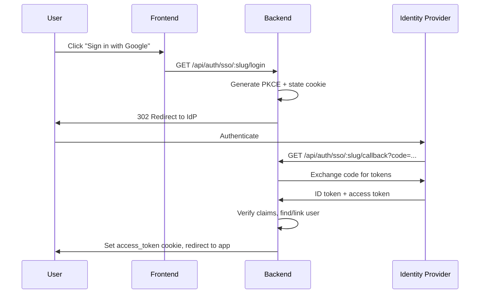
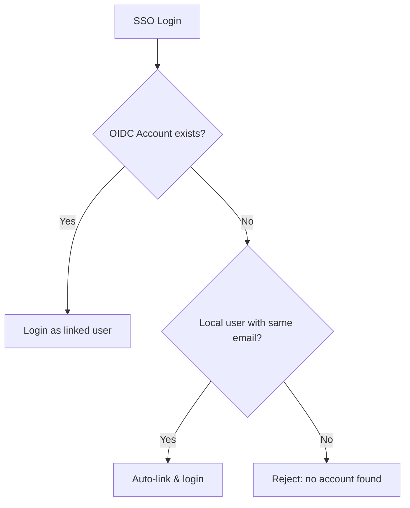

# SSO (Single Sign-On)

Integrate enterprise identity providers using OIDC for seamless single sign-on.

## Overview

Open Short URL supports **OpenID Connect (OIDC)** single sign-on, allowing users to log in with their existing organizational accounts (Google Workspace, Azure AD, Okta, etc.). Multiple providers can be configured simultaneously.

### Key Features

- Generic OIDC support — works with any OIDC-compliant identity provider
- Multiple simultaneous providers
- Auto-link by email — matches OIDC identity to existing local accounts
- SSO coexists with password login (optionally enforce SSO-only)
- Admin CRUD management via UI

## How It Works



## Setting Up Providers

### Prerequisites

1. Register your application with the identity provider
2. Obtain the **Client ID** and **Client Secret**
3. Set the **Redirect URI** to: `https://your-backend-domain/api/auth/sso/{slug}/callback`
4. Pre-create user accounts in Open Short URL (SSO does not auto-create accounts)

### Admin UI

Navigate to **System > SSO Providers** in the admin dashboard to manage providers.

| Action | Description |
|--------|-------------|
| Add Provider | Configure a new OIDC identity provider |
| Edit | Update provider settings (slug is immutable) |
| Enable/Disable | Toggle provider visibility on the login page |
| Delete | Remove a provider and unlink associated SSO accounts |

### Provider Configuration

| Field | Description | Required |
|-------|-------------|:--------:|
| Name | Display name shown on the login page | Yes |
| Slug | URL-safe identifier (e.g., `google`, `azure-ad`) | Yes |
| Discovery URL | OIDC well-known configuration URL | Yes |
| Client ID | OAuth client ID from the identity provider | Yes |
| Client Secret | OAuth client secret | Yes |
| Scopes | Space-separated OIDC scopes | No (default: `openid email profile`) |
| Active | Whether the provider appears on the login page | No (default: `true`) |

### Admin API

```
POST /api/admin/oidc-providers
```

```json
{
  "name": "Google Workspace",
  "slug": "google",
  "discoveryUrl": "https://accounts.google.com/.well-known/openid-configuration",
  "clientId": "your-client-id.apps.googleusercontent.com",
  "clientSecret": "your-client-secret",
  "scopes": "openid email profile",
  "isActive": true
}
```

::: warning
The `clientSecret` is write-only. It is accepted on create/update but never returned in API responses. A `hasClientSecret` boolean indicates whether a secret is stored.
:::

### Common Provider Examples

**Microsoft Azure AD:**
```
Discovery URL: https://login.microsoftonline.com/{tenant-id}/v2.0/.well-known/openid-configuration
```

**Okta:**
```
Discovery URL: https://{your-domain}.okta.com/.well-known/openid-configuration
```

**Keycloak:**
```
Discovery URL: https://{host}/realms/{realm}/.well-known/openid-configuration
```

### Example: Google Workspace

This step-by-step guide shows how to configure Google as an SSO provider.

#### 1. Create OAuth Credentials in Google Cloud Console

1. Go to [Google Cloud Console](https://console.cloud.google.com/) and select your project
2. Navigate to **APIs & Services > Credentials**
3. Click **Create Credentials > OAuth client ID**
4. Select **Web application** as the application type
5. Set a name (e.g., `Open Short URL SSO`)
6. Under **Authorized redirect URIs**, add:
   ```
   https://your-backend-domain/api/auth/sso/google/callback
   ```
7. Click **Create** and note down the **Client ID** and **Client Secret**

::: tip
If your Google Cloud project's OAuth consent screen is set to **Internal**, only users within your Google Workspace organization can log in. Set it to **External** if you want to allow any Google account.
:::

#### 2. Configure in Open Short URL

Navigate to **System > SSO Providers** and click **Add Provider** with the following settings:

| Field | Value |
|-------|-------|
| Name | `Google Workspace` |
| Slug | `google` |
| Discovery URL | `https://accounts.google.com/.well-known/openid-configuration` |
| Client ID | *(from step 1)* |
| Client Secret | *(from step 1)* |
| Scopes | `openid email profile` |

Or via the Admin API:

```bash
curl -X POST https://your-backend-domain/api/admin/oidc-providers \
  -H "Content-Type: application/json" \
  -H "Cookie: access_token=YOUR_TOKEN" \
  -d '{
    "name": "Google Workspace",
    "slug": "google",
    "discoveryUrl": "https://accounts.google.com/.well-known/openid-configuration",
    "clientId": "YOUR_CLIENT_ID.apps.googleusercontent.com",
    "clientSecret": "YOUR_CLIENT_SECRET",
    "scopes": "openid email profile",
    "isActive": true
  }'
```

#### 3. Pre-create User Accounts

Ensure that users who will log in via Google SSO already have accounts in Open Short URL with **matching email addresses**. SSO does not auto-create accounts.

#### 4. Test the Login

1. Go to the login page — you should see a **"Sign in with Google Workspace"** button
2. Click it to be redirected to Google's consent screen
3. After authentication, you will be redirected back to the dashboard

## Account Linking

SSO login matches users by the following logic:



1. **Existing link** — If the OIDC identity (provider + subject ID) is already linked to a local account, log in directly
2. **Email match** — If no link exists but a local account has the same email, auto-link and log in
3. **No match** — If no local account exists, the login is rejected. Admins must pre-create accounts

::: info
SSO does **not** auto-create user accounts. This is by design — only admins can create accounts in Open Short URL.
:::

## Enforce SSO

When SSO enforcement is enabled, password-based login is blocked. Users must authenticate through a configured SSO provider.

This is managed through system settings:

| Setting Key | Value | Effect |
|-------------|-------|--------|
| `sso_enforce` | `true` | Block password login when active providers exist |
| `sso_enforce` | `false` | Allow both password and SSO login (default) |

::: warning
Ensure at least one active SSO provider is configured before enabling enforcement. If enforcement is on but no active providers exist, password login remains available as a fallback.
:::

## Security

### PKCE + Nonce

All SSO flows use **PKCE** (Proof Key for Code Exchange) and **nonce** validation:
- PKCE prevents authorization code interception attacks
- Nonce prevents token replay attacks
- Both are stored in a signed, httpOnly state cookie (10-minute expiry)

### State Management

The OIDC state parameter is stored as a signed JWT in an httpOnly cookie — no server-side session storage is needed. This is consistent with the platform's stateless JWT architecture.

### SSO and 2FA

SSO login **bypasses** local two-factor authentication. The assumption is that the identity provider handles its own MFA. If you require MFA, configure it at the identity provider level.

## Error Handling

SSO errors redirect to the login page with an error code:

| Error Code | Description |
|------------|-------------|
| `sso_user_not_found` | No local account matches the SSO identity |
| `sso_account_inactive` | The matched account is deactivated |
| `sso_email_not_verified` | The identity provider reports unverified email |
| `sso_state_invalid` | SSO session expired or state mismatch |
| `sso_provider_disabled` | The SSO provider is currently disabled |
| `sso_provider_not_found` | The requested SSO provider does not exist |
| `sso_failed` | Generic SSO failure |

## Next Steps

- [API Keys](/en/features/api-keys) — Programmatic API access
- [Audit Logs](/en/features/audit-logs) — Track SSO login events
- [Webhooks](/en/features/webhooks) — Real-time event notifications
