# URL Shortening

Create, manage, and track short URLs with powerful features.

## Overview

Open Short URL transforms long URLs into short, memorable links with advanced features like custom slugs, password protection, expiration settings, and UTM tracking.

### Redirect Flow

```mermaid
flowchart TD
    Visit["🔗 Visit Short URL"] --> Check{"URL\nexists?"}
    Check -->|"No"| NotFound["❌ 404 Not Found"]
    Check -->|"Yes"| Status{"URL\nstatus?"}

    Status -->|"Expired"| Gone["⏰ 410 Gone"]
    Status -->|"Inactive"| Gone
    Status -->|"Active"| Password{"Password\nprotected?"}

    Password -->|"Yes"| Auth["🔐 Show password page"]
    Password -->|"No"| Routing{"Smart Routing\nenabled?"}

    Auth -->|"Correct"| Routing
    Auth -->|"Wrong"| Auth

    Routing -->|"Yes"| Rules["⚙️ Evaluate rules"]
    Routing -->|"No"| ABTest{"A/B Testing\nenabled?"}

    Rules -->|"Match"| Redirect["🔄 302 Redirect"]
    Rules -->|"No match"| ABTest

    ABTest -->|"Yes"| Variant["🧪 Select variant"]
    ABTest -->|"No"| Default["📍 Default URL"]

    Variant --> Redirect
    Default --> Redirect
```



## Creating Short URLs

### Basic Creation

Create a short URL by providing the original URL:

```
Original: https://example.com/very/long/path/to/page?param=value
Short:    https://s.yourdomain.com/abc123
```

### Available Options

| Option | Description | Required |
|--------|-------------|:--------:|
| `originalUrl` | The URL to shorten | ✅ |
| `customSlug` | Custom short code (3-50 chars) | ❌ |
| `title` | Descriptive title (max 255 chars) | ❌ |
| `password` | Password protection (4-128 chars) | ❌ |
| `expiresAt` | Expiration date (ISO 8601) | ❌ |
| UTM parameters | Campaign tracking | ❌ |

### Custom Slugs

Create memorable URLs with custom slugs:

```
https://s.yourdomain.com/summer-sale
https://s.yourdomain.com/my-portfolio
https://s.yourdomain.com/join-us
```

**Slug Requirements:**
- Length: 3-50 characters
- Allowed characters: `a-z`, `A-Z`, `0-9`, `_`, `-`
- Must be unique

### Auto-Generated Slugs

When no custom slug is provided, the system generates one automatically using a dynamic length strategy:

| URL Count | Slug Length |
|-----------|-------------|
| < 1,000 | 4 characters |
| < 50,000 | 5 characters |
| < 500,000 | 6 characters |
| ≥ 500,000 | 7 characters |

This ensures short slugs while minimizing collision risk.

## Password Protection

Secure sensitive links with password protection:

```
Short URL: https://s.yourdomain.com/private-doc
Password: ********
```

**Features:**
- Visitors must enter password to access
- Passwords are securely hashed (bcrypt)
- Optional Cloudflare Turnstile protection against bots

## Expiration Settings

Set time-based expiration for campaigns or temporary links:

**Expiration Types:**
- **Specific date/time** - Link expires at exact moment
- **No expiration** - Link remains active indefinitely

**URL States:**
| Status | Description |
|--------|-------------|
| `ACTIVE` | Link is accessible |
| `INACTIVE` | Manually disabled |
| `EXPIRED` | Past expiration date |

When a link expires, it automatically transitions to `EXPIRED` status and returns a 410 Gone response.

## UTM Tracking

Automatically append UTM parameters for marketing campaign tracking:

| Parameter | Description | Example |
|-----------|-------------|---------|
| `utm_source` | Traffic source | `newsletter`, `google` |
| `utm_medium` | Marketing medium | `email`, `cpc`, `social` |
| `utm_campaign` | Campaign name | `summer_sale_2025` |
| `utm_term` | Paid keywords | `running+shoes` |
| `utm_content` | Content identifier | `banner_top`, `link_footer` |

**Example:**
```
Short URL: https://s.yourdomain.com/promo
Redirects to: https://shop.example.com/sale?utm_source=newsletter&utm_medium=email&utm_campaign=summer_sale
```

## QR Codes

Generate QR codes for any short URL:

```
GET /api/urls/{id}/qrcode?width=300&color=%23000000
```

**Options:**
| Parameter | Description | Default |
|-----------|-------------|---------|
| `width` | QR code width in pixels | 300 |
| `color` | QR code color (hex) | #000000 |

**Response:** Base64 Data URL (can be used directly in ``)

## Bulk Operations

### Bulk Create

Create multiple URLs in a single request:

```json
POST /api/urls/bulk

{
  "urls": [
    { "originalUrl": "https://example.com/page1", "title": "Page 1" },
    { "originalUrl": "https://example.com/page2", "title": "Page 2" },
    { "originalUrl": "https://example.com/page3", "customSlug": "page-3" }
  ]
}
```

**Limits:**
- Admin users: up to 100 URLs per request
- Regular users: up to 50 URLs per request

**Response includes:**
- `success` - Successfully created URLs
- `failed` - Failed items with error details

### Bulk Update

Update multiple URLs at once:

```json
PATCH /api/urls/bulk

{
  "urlIds": ["id1", "id2", "id3"],
  "operation": "status",
  "value": "INACTIVE"
}
```

**Supported Operations:**
| Operation | Description | Value |
|-----------|-------------|-------|
| `status` | Change status | `ACTIVE` or `INACTIVE` |
| `bundle` | Add to bundle | Bundle ID |
| `expiration` | Set expiration | ISO 8601 date or `null` |
| `utm` | Update UTM params | UTM object |

### Bulk Delete

Delete multiple URLs:

```json
DELETE /api/urls/bulk

{
  "urlIds": ["id1", "id2", "id3"]
}
```

::: warning
Bulk delete also removes all associated click records.
:::

### CSV Import/Export

**Export URLs:**
```
GET /api/urls/export?format=csv
```

**Import URLs:**
```
POST /api/urls/import
Content-Type: multipart/form-data

file: urls.csv
```

**CSV Format:**
```csv
originalUrl,customSlug,title,password,expiresAt,utmSource,utmMedium,utmCampaign
https://example.com/page1,my-page,My Page,,,newsletter,email,summer
https://example.com/page2,,Another Page,,2025-12-31T23:59:59Z,,,
```

## URL Management

### Query URLs

```
GET /api/urls?page=1&pageSize=10&search=campaign&status=ACTIVE&sortBy=clickCount&sortOrder=desc
```

**Query Parameters:**
| Parameter | Description | Default |
|-----------|-------------|---------|
| `page` | Page number | 1 |
| `pageSize` | Items per page | 10 |
| `search` | Search title/URL | - |
| `status` | Filter by status | - |
| `sortBy` | Sort field | `createdAt` |
| `sortOrder` | Sort direction | `desc` |

**Sortable Fields:** `createdAt`, `clickCount`, `title`

### Update URL

```json
PUT /api/urls/{id}

{
  "title": "Updated Title",
  "status": "INACTIVE",
  "password": "new-password"
}
```

### Delete URL

```
DELETE /api/urls/{id}
```

::: warning
Deleting a URL also removes all associated click records and analytics data.
:::

## Dashboard Statistics

Get overview statistics for all your URLs:

```
GET /api/urls/stats
```

**Response:**
```json
{
  "total": 150,
  "active": 120,
  "inactive": 20,
  "expired": 10
}
```

## Best Practices

1. **Use descriptive slugs** - Make URLs memorable and meaningful
2. **Set expiration dates** - Clean up temporary campaign links
3. **Track campaigns with UTM** - Measure marketing effectiveness
4. **Organize with bundles** - Group related URLs together
5. **Use password protection sparingly** - Only for sensitive content
6. **Monitor click analytics** - Understand your audience

## API Rate Limits

| Operation | Limit |
|-----------|-------|
| Bulk create | 5 requests/minute |
| Bulk update | 5 requests/minute |
| Bulk delete | 5 requests/minute |
| Regular operations | 100 requests/minute |

## Next Steps

- [Analytics](/en/features/analytics) - Track URL performance
- [A/B Testing](/en/features/ab-testing) - Optimize conversions
- [Smart Routing](/en/features/smart-routing) - Conditional redirects
- [Bundles](/en/features/bundles) - Organize URLs
