# Webhooks

Receive real-time notifications when events occur in your short URL system.

## Overview

Webhooks allow you to integrate Open Short URL with external systems by sending HTTP requests when specific events occur, such as URL clicks or creation.


### Webhook Lifecycle

```mermaid
flowchart LR
    Event["📢 Event\nOccurs"] --> Queue["📋 Queue\nWebhook"]
    Queue --> Send["📤 Send\nRequest"]
    Send --> Check{"Response\nOK?"}
    Check -->|"2xx"| Success["✅ Success"]
    Check -->|"Error"| Retry["🔄 Retry\n(up to 3x)"]
    Retry --> Send
    Retry -->|"Max retries"| Failed["❌ Failed"]
```



## Supported Events

| Event | Description |
|-------|-------------|
| `url.created` | New short URL created |
| `url.updated` | Short URL updated |
| `url.deleted` | Short URL deleted |
| `url.clicked` | Short URL was clicked |
| `routing.rule_created` | Routing rule created |
| `routing.rule_updated` | Routing rule updated |
| `routing.rule_deleted` | Routing rule deleted |
| `routing.rule_matched` | Routing rule matched a visitor |

## Creating Webhooks

### Create a Webhook

```json
POST /api/webhooks

{
  "name": "Click Notifications",
  "url": "https://your-server.com/webhooks/clicks",
  "secret": "your-webhook-secret",
  "events": ["url.clicked"],
  "headers": {
    "Authorization": "Bearer your-token"
  },
  "isActive": true
}
```

**Parameters:**

| Parameter | Description | Required | Default |
|-----------|-------------|:--------:|---------|
| `name` | Webhook name (max 100 chars) | ✅ | - |
| `url` | Target URL (public, HTTPS) | ✅ | - |
| `secret` | Signing secret (max 255 chars) | ❌ | - |
| `events` | Events to subscribe to | ✅ | - |
| `headers` | Custom HTTP headers | ❌ | {} |
| `isActive` | Enable webhook | ❌ | true |

### Event Selection

Subscribe to multiple events:

```json
{
  "events": ["url.created", "url.clicked", "url.deleted"]
}
```

::: warning
You must specify at least one event.
:::

## Managing Webhooks

### List Webhooks

```
GET /api/webhooks?page=1&pageSize=10&search=click
```

### Get Webhook Details

```
GET /api/webhooks/{id}
```

### Update Webhook

```json
PUT /api/webhooks/{id}

{
  "name": "Updated Name",
  "events": ["url.clicked", "url.created"],
  "isActive": true
}
```

### Delete Webhook

```
DELETE /api/webhooks/{id}
```

## Payload Structure

### Common Fields

All webhook payloads include:

```json
{
  "event": "url.clicked",
  "timestamp": "2025-01-15T10:30:00Z",
  "data": { ... }
}
```

### url.created

```json
{
  "event": "url.created",
  "timestamp": "2025-01-15T10:30:00Z",
  "data": {
    "id": "url_123",
    "slug": "my-link",
    "originalUrl": "https://example.com/page",
    "title": "My Link",
    "userId": "user_456",
    "createdAt": "2025-01-15T10:30:00Z"
  }
}
```

### url.updated

```json
{
  "event": "url.updated",
  "timestamp": "2025-01-15T10:35:00Z",
  "data": {
    "id": "url_123",
    "slug": "my-link",
    "changes": {
      "title": {
        "old": "Old Title",
        "new": "New Title"
      }
    }
  }
}
```

### url.clicked

```json
{
  "event": "url.clicked",
  "timestamp": "2025-01-15T10:40:00Z",
  "data": {
    "urlId": "url_123",
    "variantId": "var_789",
    "clickData": {
      "ip": "192.168.1.1",
      "userAgent": "Mozilla/5.0...",
      "referer": "https://google.com",
      "country": "Taiwan",
      "city": "Taipei",
      "device": "Mobile",
      "os": "iOS",
      "browser": "Safari",
      "utmSource": "newsletter",
      "utmMedium": "email",
      "utmCampaign": "summer",
      "utmTerm": null,
      "utmContent": null
    }
  }
}
```

### routing.rule_matched

```json
{
  "event": "routing.rule_matched",
  "timestamp": "2025-01-15T10:45:00Z",
  "data": {
    "urlId": "url_123",
    "ruleId": "rule_456",
    "ruleName": "iOS Users",
    "targetUrl": "https://apps.apple.com/app/myapp",
    "clickData": { ... }
  }
}
```

## Signature Verification

Verify webhook authenticity using the signature header.

### Headers Sent

| Header | Description |
|--------|-------------|
| `X-Webhook-Signature` | HMAC-SHA256 signature |
| `X-Webhook-Event` | Event type |
| `X-Webhook-Delivery-ID` | Unique delivery ID |

### Signature Format

```
X-Webhook-Signature: sha256=<hash>
```

### Verification Steps

1. Get the raw request body (JSON string)
2. Compute HMAC-SHA256 using your secret
3. Compare with the signature header

**Node.js Example:**

```javascript
const crypto = require('crypto');

function verifyWebhookSignature(payload, signature, secret) {
  const expectedSignature = 'sha256=' +
    crypto.createHmac('sha256', secret)
      .update(payload)
      .digest('hex');

  return crypto.timingSafeEqual(
    Buffer.from(signature),
    Buffer.from(expectedSignature)
  );
}

// In your webhook handler
app.post('/webhook', (req, res) => {
  const signature = req.headers['x-webhook-signature'];
  const payload = JSON.stringify(req.body);

  if (!verifyWebhookSignature(payload, signature, 'your-secret')) {
    return res.status(401).send('Invalid signature');
  }

  // Process webhook...
  res.status(200).send('OK');
});
```

**Python Example:**

```python
import hmac
import hashlib

def verify_webhook_signature(payload, signature, secret):
    expected = 'sha256=' + hmac.new(
        secret.encode(),
        payload.encode(),
        hashlib.sha256
    ).hexdigest()
    return hmac.compare_digest(signature, expected)
```

## Delivery & Retries

### Delivery Statistics

Each webhook tracks:

| Metric | Description |
|--------|-------------|
| `totalSent` | Total deliveries attempted |
| `totalSuccess` | Successful deliveries |
| `totalFailed` | Failed deliveries |
| `lastSentAt` | Last delivery timestamp |
| `lastError` | Last error message |

### Retry Behavior

Failed deliveries are retried automatically:
- Exponential backoff
- Maximum 3 retry attempts
- Logged for debugging

### Webhook Logs

View delivery history:

```
GET /api/webhooks/{id}/logs?page=1&pageSize=20
```

**Response:**

```json
{
  "logs": [
    {
      "id": "log_123",
      "event": "url.clicked",
      "status": "success",
      "statusCode": 200,
      "responseBody": "OK",
      "attempt": 1,
      "sentAt": "2025-01-15T10:40:00Z"
    },
    {
      "id": "log_124",
      "event": "url.clicked",
      "status": "failed",
      "statusCode": 500,
      "responseBody": "Internal Server Error",
      "attempt": 1,
      "sentAt": "2025-01-15T10:45:00Z"
    }
  ]
}
```

## Testing Webhooks

### Send Test Payload

```
POST /api/webhooks/{id}/test
```

Sends a test payload to verify your endpoint is working:

```json
{
  "event": "webhook.test",
  "timestamp": "2025-01-15T10:50:00Z",
  "data": {
    "message": "This is a test webhook delivery"
  }
}
```

## Best Practices

### 1. Always Verify Signatures

Never trust webhook payloads without verification:
- Always set a webhook secret
- Verify every incoming request
- Reject invalid signatures

### 2. Respond Quickly

Return 200 OK as fast as possible:
- Process webhooks asynchronously
- Use message queues for heavy processing
- Respond before doing work

### 3. Handle Idempotency

Webhooks may be delivered multiple times:
- Store processed delivery IDs
- Skip duplicate deliveries
- Design handlers to be idempotent

### 4. Use HTTPS

Always use HTTPS endpoints:
- Protects payload data
- Required for signature verification
- Prevents man-in-the-middle attacks

### 5. Monitor Failures

Watch for delivery issues:
- Check webhook logs regularly
- Set up alerts for failures
- Investigate persistent errors

## Use Cases

### Real-Time Analytics

Track clicks in external systems:

```json
{
  "events": ["url.clicked"]
}
```

→ Send to Google Analytics, Mixpanel, etc.

### Slack Notifications

Get notified of new URLs:

```json
{
  "events": ["url.created"],
  "url": "https://hooks.slack.com/services/..."
}
```

### CRM Integration

Update customer records on clicks:

```json
{
  "events": ["url.clicked"],
  "headers": {
    "X-API-Key": "your-crm-key"
  }
}
```

### Custom Dashboards

Feed data to your own analytics:

```json
{
  "events": ["url.clicked", "url.created", "url.deleted"]
}
```

## Rate Limits

| Operation | Limit |
|-----------|-------|
| Webhook management | 5 requests/minute |
| Webhook deliveries | No limit (async) |

## Webhook Timeout

- Default timeout: 30 seconds
- Requests timing out are marked as failed
- Configure via `WEBHOOK_TIMEOUT` environment variable

## Next Steps

- [API Keys](/en/features/api-keys) - Authenticate API requests
- [Analytics](/en/features/analytics) - Track performance
- [Smart Routing](/en/features/smart-routing) - Conditional routing
