# Introduction

Open Short URL is an open-source, white-label, self-hostable URL shortener platform with powerful analytics and A/B testing capabilities.

## Overview

Open Short URL provides a complete solution for creating, managing, and analyzing short URLs. Built with modern technologies (NestJS + Next.js), it offers enterprise-grade features while remaining easy to deploy and customize.

## Key Features

### URL Management
- **Custom Slugs** - Create memorable short URLs with custom aliases
- **Password Protection** - Secure sensitive links with passwords
- **Expiration Settings** - Set time-based or click-based expiration
- **UTM Tracking** - Automatically append UTM parameters
- **QR Code Generation** - Generate QR codes for any short URL
- **Bulk Operations** - Import/export URLs via CSV

### Analytics & Insights
- **Real-time Tracking** - Monitor clicks as they happen
- **Geographic Analysis** - Country, region, and city-level data
- **Device & Browser Stats** - Identify visitor devices and browsers
- **Referrer Tracking** - Understand traffic sources
- **Bot Detection** - Filter out bot traffic from reports
- **Data Export** - Export analytics to CSV or JSON

### A/B Testing & Smart Routing
- **Traffic Splitting** - Distribute traffic across multiple destinations
- **Conditional Routing** - Route based on device, location, time, and more
- **Routing Templates** - Pre-built rules for common scenarios
- **Performance Analytics** - Compare variant performance

### Enterprise Features
- **White-labeling** - Customize branding (logo, colors, name)
- **API Access** - Full REST API with OpenAPI documentation
- **Webhook Integration** - Real-time event notifications
- **Audit Logging** - Track all system activities
- **Two-Factor Authentication** - Enhanced account security
- **User Management** - Multi-user support with roles

## Tech Stack

| Layer | Technology |
|-------|------------|
| **Backend** | NestJS 11 + Fastify |
| **Frontend** | Next.js 16 + React 19 |
| **Database** | PostgreSQL 15+ |
| **Cache** | Redis 7+ |
| **ORM** | Prisma 7 |
| **UI** | Tailwind CSS + shadcn/ui |
| **Auth** | JWT + Passport.js |

## Architecture

```mermaid
flowchart TB
    subgraph Client["🌐 Client"]
        Browser["Browser"]
        Mobile["Mobile App"]
        API_Client["API Client"]
    end

    subgraph Frontend["⚛️ Frontend"]
        NextJS["Next.js 16 + React 19"]
        TailwindUI["Tailwind CSS + shadcn/ui"]
    end

    subgraph Backend["🔧 Backend"]
        NestJS["NestJS 11 + Fastify"]
        Prisma["Prisma ORM"]
        Auth["JWT + Passport.js"]
    end

    subgraph Storage["💾 Storage"]
        PostgreSQL[("PostgreSQL\n(Primary DB)")]
        Redis[("Redis\n(Cache + Session)")]
    end

    Client --> Frontend
    Client --> Backend
    Frontend <-->|REST API| Backend
    Backend <--> PostgreSQL
    Backend <--> Redis
```

### Request Flow

## Why Open Short URL?

### Open Source
- MIT licensed, fully transparent code
- Active development and community
- No vendor lock-in

### Self-Hosted
- Complete data ownership
- Deploy on your infrastructure
- Compliance with data regulations

### Feature-Rich
- Enterprise features without enterprise pricing
- Comprehensive analytics out of the box
- Extensible via API and webhooks

### Developer-Friendly
- Modern tech stack
- TypeScript end-to-end
- Auto-generated API types
- Comprehensive documentation

## Use Cases

- **Marketing Teams** - Track campaign performance with UTM parameters
- **Product Teams** - A/B test landing pages and features
- **Developers** - Integrate via API for dynamic link generation
- **Enterprises** - Self-host for data compliance and branding
- **Content Creators** - Share and track link engagement

## Getting Started

Ready to get started? Follow our guides:

1. [Quick Start](/en/guide/getting-started) - Get up and running in 5 minutes
2. [Installation](/en/guide/installation) - Detailed installation instructions
3. [Configuration](/en/guide/configuration) - Configure for your environment
4. [Docker Deployment](/en/deployment/docker) - Deploy with Docker

## Community & Support

- **GitHub**: [github.com/supra126/open-short-url](https://github.com/supra126/open-short-url)
- **Issues**: [Report bugs and request features](https://github.com/supra126/open-short-url/issues)
- **License**: MIT
