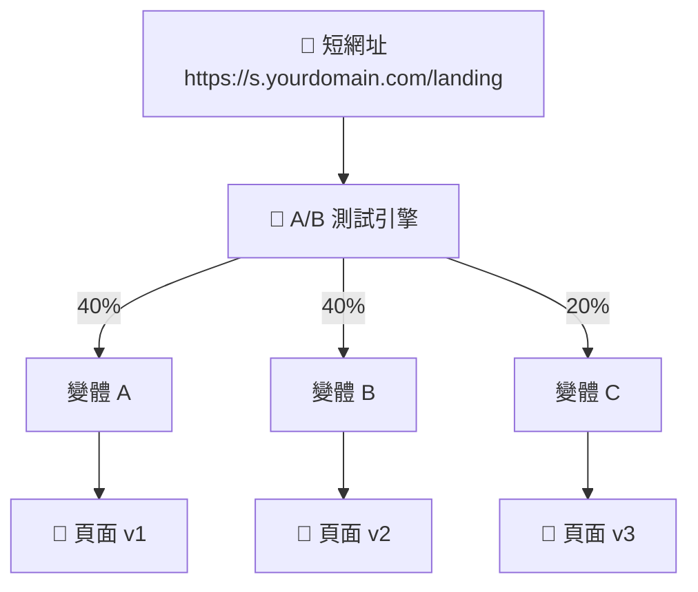
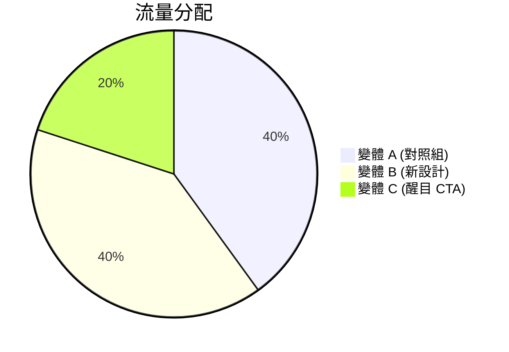

# A/B 測試

分流導向不同目標網址以優化轉換率。

## 概覽

A/B 測試讓您根據設定的權重將訪客導向不同的網址，幫助您找出表現最佳的頁面版本。



### 流量分配



## 建立 A/B 測試

### 啟用 A/B 測試

首先，為短網址啟用 A/B 測試：

```json
PATCH /api/urls/{urlId}

{
  "isABTesting": true
}
```

### 建立變體

```json
POST /api/urls/{urlId}/variants

{
  "name": "變體 A - 原始設計",
  "targetUrl": "https://example.com/landing-v1",
  "weight": 50,
  "isActive": true
}
```

**參數：**

| 參數 | 說明 | 必填 | 預設值 |
|-----|------|:----:|--------|
| `name` | 變體名稱（1-100 字元） | ✅ | - |
| `targetUrl` | 目標網址 | ✅ | - |
| `weight` | 流量權重（0-100） | ✅ | - |
| `isActive` | 是否啟用 | ❌ | true |

### 範例設定

建立 50/50 的 A/B 測試：

```json
// 變體 A
POST /api/urls/{urlId}/variants
{
  "name": "控制組 - 原始頁面",
  "targetUrl": "https://example.com/landing-original",
  "weight": 50
}

// 變體 B
POST /api/urls/{urlId}/variants
{
  "name": "測試組 - 新設計",
  "targetUrl": "https://example.com/landing-new",
  "weight": 50
}
```

## 管理變體

### 列出變體

```
GET /api/urls/{urlId}/variants
```

**回應：**

```json
{
  "variants": [
    {
      "id": "var_123",
      "name": "控制組",
      "targetUrl": "https://example.com/v1",
      "weight": 50,
      "isActive": true,
      "clickCount": 1250,
      "createdAt": "2025-01-01T00:00:00Z"
    },
    {
      "id": "var_456",
      "name": "測試組",
      "targetUrl": "https://example.com/v2",
      "weight": 50,
      "isActive": true,
      "clickCount": 1180,
      "createdAt": "2025-01-01T00:00:00Z"
    }
  ],
  "totalWeight": 100
}
```

### 取得單一變體

```
GET /api/urls/{urlId}/variants/{variantId}
```

### 更新變體

```json
PUT /api/urls/{urlId}/variants/{variantId}

{
  "name": "測試組 - 更新版",
  "weight": 60,
  "isActive": true
}
```

### 刪除變體

```
DELETE /api/urls/{urlId}/variants/{variantId}
```

::: warning
刪除最後一個變體時，A/B 測試會自動停用。
:::

## 流量分配

### 權重系統

權重決定每個變體接收的流量比例：

| 變體 | 權重 | 實際分配 |
|------|------|---------|
| A | 50 | 50% |
| B | 30 | 30% |
| C | 20 | 20% |

**權重規則：**

- 權重範圍：0-100
- 總權重不需要等於 100（會按比例計算）
- 權重為 0 的變體不會接收流量

### 分配演算法

```
訪客分配機率 = 變體權重 / 所有啟用變體的權重總和
```

**範例：**

```
變體 A 權重：60
變體 B 權重：40
總權重：100

變體 A 機率 = 60/100 = 60%
變體 B 機率 = 40/100 = 40%
```

### 調整權重

即時調整變體權重：

```json
PUT /api/urls/{urlId}/variants/{variantId}

{
  "weight": 70
}
```

::: info
權重變更立即生效，對新訪客生效。
:::

## A/B 測試分析

### 取得分析資料

```
GET /api/analytics/ab-test?startDate=2025-01-01&endDate=2025-01-31
```

**回應：**

```json
{
  "tests": [
    {
      "urlId": "url_123",
      "slug": "landing",
      "variants": [
        {
          "id": "var_a",
          "name": "控制組",
          "clicks": 1250,
          "uniqueVisitors": 1100,
          "weight": 50,
          "actualPercentage": 51.4
        },
        {
          "id": "var_b",
          "name": "測試組",
          "clicks": 1180,
          "uniqueVisitors": 1050,
          "weight": 50,
          "actualPercentage": 48.6
        }
      ],
      "totalClicks": 2430,
      "startDate": "2025-01-01",
      "daysRunning": 15
    }
  ]
}
```

### 變體表現比較

```json
{
  "comparison": {
    "winner": "var_b",
    "improvement": 12.5,
    "confidence": 95,
    "sampleSize": 2430
  }
}
```

## 與智慧路由整合

A/B 測試可以與智慧路由一起使用：

### 優先順序

1. **智慧路由規則先評估**
2. **如果沒有規則匹配，則套用 A/B 測試**
3. **最後使用預設網址**

### 使用案例

為特定區段進行 A/B 測試：

```
所有流量
    │
    ├── iOS 使用者 → App Store（智慧路由）
    │
    └── 其他使用者 → A/B 測試
            ├── 50% → 著陸頁 V1
            └── 50% → 著陸頁 V2
```

## 最佳實踐

### 1. 從 50/50 開始

初始測試使用均等分配：

```json
{
  "variants": [
    { "name": "控制組", "weight": 50 },
    { "name": "測試組", "weight": 50 }
  ]
}
```

### 2. 收集足夠樣本

確保有足夠的數據才下結論：

| 轉換率 | 建議最小樣本 |
|--------|-------------|
| > 5% | 1,000 次點擊/變體 |
| 1-5% | 5,000 次點擊/變體 |
| < 1% | 10,000 次點擊/變體 |

### 3. 一次測試一個變數

隔離變更以獲得清晰結果：

- ✅ 只改變按鈕顏色
- ✅ 只改變標題文字
- ❌ 同時改變多個元素

### 4. 設定明確目標

定義成功指標：

- 點擊率（CTR）
- 轉換率
- 跳出率
- 停留時間

### 5. 執行足夠時間

考慮時間因素：

- 至少執行 1-2 週
- 涵蓋完整的業務週期
- 避免在特殊時期（節日等）開始

### 6. 逐步調整

根據結果逐步最佳化：

```
週 1-2：50/50 測試
週 3：勝出者 70/30
週 4：確認結果後結束測試
```

## 使用案例

### 著陸頁優化

測試不同的著陸頁設計：

```json
{
  "name": "著陸頁測試",
  "variants": [
    {
      "name": "原始設計",
      "targetUrl": "https://example.com/landing-original",
      "weight": 50
    },
    {
      "name": "新設計 - 大CTA",
      "targetUrl": "https://example.com/landing-big-cta",
      "weight": 50
    }
  ]
}
```

### 定價頁面測試

測試不同的定價呈現方式：

```json
{
  "name": "定價頁面測試",
  "variants": [
    {
      "name": "月付方案優先",
      "targetUrl": "https://example.com/pricing-monthly",
      "weight": 33
    },
    {
      "name": "年付方案優先",
      "targetUrl": "https://example.com/pricing-annual",
      "weight": 33
    },
    {
      "name": "企業方案優先",
      "targetUrl": "https://example.com/pricing-enterprise",
      "weight": 34
    }
  ]
}
```

### 行銷活動測試

測試不同的促銷訊息：

```json
{
  "name": "夏季促銷測試",
  "variants": [
    {
      "name": "折扣強調",
      "targetUrl": "https://example.com/summer-discount",
      "weight": 50
    },
    {
      "name": "限時強調",
      "targetUrl": "https://example.com/summer-limited",
      "weight": 50
    }
  ]
}
```

### 多變體測試（MVT）

同時測試多個版本：

```json
{
  "name": "首頁 MVT",
  "variants": [
    { "name": "版本 A", "weight": 25 },
    { "name": "版本 B", "weight": 25 },
    { "name": "版本 C", "weight": 25 },
    { "name": "版本 D", "weight": 25 }
  ]
}
```

## 速率限制

| 操作 | 限制 |
|-----|------|
| 變體管理 | 30 次/分鐘 |

## 下一步

- [數據分析](/zh-TW/features/analytics) - 詳細分析
- [智慧路由](/zh-TW/features/smart-routing) - 條件式路由
- [網址分組](/zh-TW/features/bundles) - 整理您的測試
