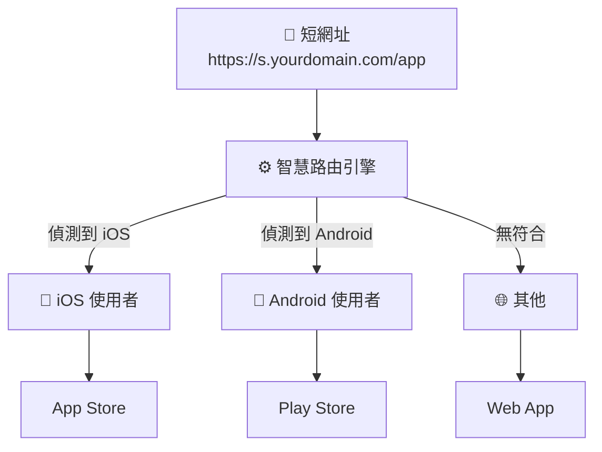
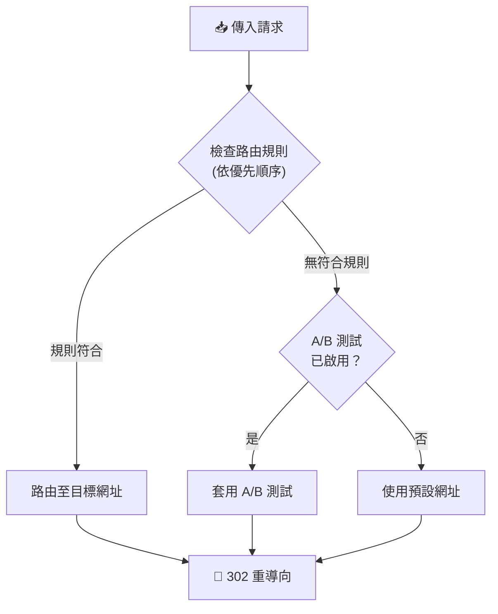

# 智慧路由

根據裝置、位置、時間等條件將訪客導向不同目標。

## 概覽

智慧路由可根據訪客屬性進行條件式重新導向。建立規則以動態導向流量，無需建立多個短網址。



### 決策流程



## 建立路由規則

### 基本規則建立

```json
POST /api/urls/{urlId}/routing-rules

{
  "name": "iOS 使用者導向 App Store",
  "targetUrl": "https://apps.apple.com/app/myapp",
  "priority": 100,
  "isActive": true,
  "conditions": {
    "operator": "AND",
    "conditions": [
      {
        "type": "os",
        "operator": "equals",
        "value": "iOS"
      }
    ]
  }
}
```

**參數：**

| 參數 | 說明 | 必填 | 預設值 |
|-----|------|:----:|--------|
| `name` | 規則名稱（1-100 字元） | ✅ | - |
| `targetUrl` | 目標網址 | ✅ | - |
| `priority` | 評估順序（0-10000） | ❌ | 0 |
| `isActive` | 是否啟用 | ❌ | true |
| `conditions` | 路由條件 | ✅ | - |

### 優先順序系統

規則依優先順序由高到低評估：
- 數字越大 = 越先評估
- 第一個匹配的規則生效
- 無匹配 = 使用預設網址

```
優先順序 100：iOS → App Store
優先順序 90：Android → Play Store
優先順序 0：（預設）→ 網站
```

## 條件類型

### 裝置條件

| 類型 | 運算符 | 值 |
|-----|--------|-----|
| `device` | equals | `MOBILE`、`DESKTOP`、`TABLET` |

```json
{
  "type": "device",
  "operator": "equals",
  "value": "MOBILE"
}
```

### 作業系統

| 類型 | 運算符 | 值 |
|-----|--------|-----|
| `os` | equals、contains | iOS、Android、Windows、macOS、Linux |

```json
{
  "type": "os",
  "operator": "equals",
  "value": "iOS"
}
```

### 瀏覽器

| 類型 | 運算符 | 值 |
|-----|--------|-----|
| `browser` | equals、contains | Chrome、Safari、Firefox、Edge 等 |

```json
{
  "type": "browser",
  "operator": "contains",
  "value": "Chrome"
}
```

### 地理位置

| 類型 | 運算符 | 值 |
|-----|--------|-----|
| `country` | equals、not_equals、in | ISO 國家代碼（TW、US、CN） |
| `region` | equals、contains | 州/省名稱 |
| `city` | equals、contains | 城市名稱 |

```json
{
  "type": "country",
  "operator": "in",
  "value": ["TW", "HK", "SG"]
}
```

### 語言

| 類型 | 運算符 | 值 |
|-----|--------|-----|
| `language` | equals、contains | 語言代碼（zh-TW、en-US） |

```json
{
  "type": "language",
  "operator": "contains",
  "value": "zh"
}
```

### 時間條件

| 類型 | 運算符 | 值 |
|-----|--------|-----|
| `time` | between、before、after | 時間範圍（HH:MM 格式） |
| `day_of_week` | in | 星期陣列（1=週一 到 7=週日） |

```json
{
  "type": "time",
  "operator": "between",
  "value": { "start": "09:00", "end": "18:00" }
}
```

```json
{
  "type": "day_of_week",
  "operator": "in",
  "value": [1, 2, 3, 4, 5]
}
```

### 來源網址

| 類型 | 運算符 | 值 |
|-----|--------|-----|
| `referer` | contains、starts_with、ends_with | URL 模式 |

```json
{
  "type": "referer",
  "operator": "contains",
  "value": "facebook.com"
}
```

### UTM 參數

| 類型 | 運算符 | 值 |
|-----|--------|-----|
| `utm_source` | equals、contains | 來源值 |
| `utm_medium` | equals、contains | 媒介值 |
| `utm_campaign` | equals、contains | 活動值 |
| `utm_term` | equals | 關鍵字值 |
| `utm_content` | equals | 內容值 |

```json
{
  "type": "utm_source",
  "operator": "equals",
  "value": "newsletter"
}
```

## 運算符參考

| 運算符 | 說明 | 範例 |
|--------|-----|------|
| `equals` | 完全匹配 | `"iOS"` |
| `not_equals` | 不等於 | `"Windows"` |
| `contains` | 包含子字串 | `"Chrome"` |
| `not_contains` | 不包含 | `"bot"` |
| `in` | 在陣列中 | `["TW", "US"]` |
| `not_in` | 不在陣列中 | `["CN", "RU"]` |
| `starts_with` | 開頭為 | `"https://"` |
| `ends_with` | 結尾為 | `".com"` |
| `between` | 在範圍內（時間） | `{"start": "09:00", "end": "18:00"}` |
| `before` | 之前（時間） | `"12:00"` |
| `after` | 之後（時間） | `"18:00"` |

## 組合條件

### AND 邏輯

所有條件都必須匹配：

```json
{
  "operator": "AND",
  "conditions": [
    { "type": "device", "operator": "equals", "value": "MOBILE" },
    { "type": "country", "operator": "equals", "value": "US" }
  ]
}
```

### OR 邏輯

任一條件匹配即可：

```json
{
  "operator": "OR",
  "conditions": [
    { "type": "os", "operator": "equals", "value": "iOS" },
    { "type": "os", "operator": "equals", "value": "macOS" }
  ]
}
```

### 巢狀條件

組合 AND 和 OR：

```json
{
  "operator": "AND",
  "conditions": [
    {
      "operator": "OR",
      "conditions": [
        { "type": "os", "operator": "equals", "value": "iOS" },
        { "type": "os", "operator": "equals", "value": "Android" }
      ]
    },
    { "type": "time", "operator": "between", "value": { "start": "09:00", "end": "18:00" } }
  ]
}
```

## 路由範本

使用預建範本快速建立常見場景。

### 可用範本

| 範本 Key | 說明 |
|----------|------|
| `APP_DOWNLOAD_IOS` | 將 iOS 使用者導向 App Store |
| `APP_DOWNLOAD_ANDROID` | 將 Android 使用者導向 Play Store |
| `MULTILANG_TW` | 將繁體中文使用者導向 |
| `MULTILANG_CN` | 將簡體中文使用者導向 |
| `BUSINESS_HOURS` | 營業時間內導向（9-18，週一至週五） |
| `MOBILE_ONLY` | 將行動裝置使用者導向 |
| `DESKTOP_ONLY` | 將桌面使用者導向 |

### 從範本建立規則

```json
POST /api/urls/{urlId}/routing-rules/from-template

{
  "templateKey": "APP_DOWNLOAD_IOS",
  "targetUrl": "https://apps.apple.com/app/myapp"
}
```

## 管理規則

### 列出規則

```
GET /api/urls/{urlId}/routing-rules
```

### 取得單一規則

```
GET /api/urls/{urlId}/routing-rules/{ruleId}
```

### 更新規則

```json
PUT /api/urls/{urlId}/routing-rules/{ruleId}

{
  "name": "更新後的名稱",
  "priority": 150,
  "isActive": true
}
```

### 刪除規則

```
DELETE /api/urls/{urlId}/routing-rules/{ruleId}
```

## 智慧路由設定

### 啟用/停用智慧路由

```json
PATCH /api/urls/{urlId}/routing-rules/settings

{
  "isSmartRouting": true,
  "defaultUrl": "https://example.com/default"
}
```

**設定：**

| 設定 | 說明 |
|-----|------|
| `isSmartRouting` | 啟用智慧路由 |
| `defaultUrl` | 無規則匹配時的備用網址 |

## 路由分析

查看規則表現：

```
GET /api/analytics/urls/{id}/routing
```

**回應包含：**
- 每個規則的匹配次數
- 流量分布
- 時間趨勢

## 使用案例

### 應用程式商店導向

將使用者導向適當的應用程式商店：

```json
// 規則 1：iOS → App Store（優先順序 100）
{
  "name": "iOS App Store",
  "targetUrl": "https://apps.apple.com/app/myapp",
  "priority": 100,
  "conditions": {
    "operator": "AND",
    "conditions": [{ "type": "os", "operator": "equals", "value": "iOS" }]
  }
}

// 規則 2：Android → Play Store（優先順序 90）
{
  "name": "Android Play Store",
  "targetUrl": "https://play.google.com/store/apps/myapp",
  "priority": 90,
  "conditions": {
    "operator": "AND",
    "conditions": [{ "type": "os", "operator": "equals", "value": "Android" }]
  }
}

// 預設：Web app
```

### 多語言導向

將使用者導向本地化頁面：

```json
// 繁體中文（台灣、香港）
{
  "name": "繁體中文",
  "targetUrl": "https://example.com/zh-tw",
  "priority": 100,
  "conditions": {
    "operator": "OR",
    "conditions": [
      { "type": "country", "operator": "in", "value": ["TW", "HK"] },
      { "type": "language", "operator": "contains", "value": "zh-TW" }
    ]
  }
}

// 簡體中文（中國）
{
  "name": "簡體中文",
  "targetUrl": "https://example.com/zh-cn",
  "priority": 90,
  "conditions": {
    "operator": "OR",
    "conditions": [
      { "type": "country", "operator": "equals", "value": "CN" },
      { "type": "language", "operator": "contains", "value": "zh-CN" }
    ]
  }
}
```

### 營業時間導向

依上班時間不同導向：

```json
{
  "name": "營業時間 - 線上客服",
  "targetUrl": "https://example.com/live-chat",
  "priority": 100,
  "conditions": {
    "operator": "AND",
    "conditions": [
      { "type": "time", "operator": "between", "value": { "start": "09:00", "end": "18:00" } },
      { "type": "day_of_week", "operator": "in", "value": [1, 2, 3, 4, 5] }
    ]
  }
}

// 非營業時間 → FAQ 頁面（預設）
```

### 活動特定導向

依流量來源導向：

```json
{
  "name": "電子報訂閱者",
  "targetUrl": "https://example.com/special-offer",
  "priority": 100,
  "conditions": {
    "operator": "AND",
    "conditions": [
      { "type": "utm_source", "operator": "equals", "value": "newsletter" }
    ]
  }
}
```

## 與 A/B 測試整合

智慧路由與 A/B 測試可以一起運作：

1. **先評估路由規則**
2. **如果沒有規則匹配，則套用 A/B 測試**（如有啟用）
3. **最後使用預設網址**

這可實現針對特定區段的 A/B 測試。

## 最佳實踐

1. **使用清晰的優先順序** - 保留間隔（100、90、80）以便未來新增
2. **充分測試規則** - 確認條件如預期運作
3. **先寬泛，後精細** - 一般規則優先，特定規則其次
4. **監控分析** - 追蹤哪些規則正在匹配
5. **記錄複雜規則** - 使用描述性名稱

## 速率限制

| 操作 | 限制 |
|-----|------|
| 規則管理 | 30 次/分鐘 |

## 下一步

- [A/B 測試](/zh-TW/features/ab-testing) - 結合實驗
- [數據分析](/zh-TW/features/analytics) - 追蹤路由表現
- [Webhooks](/zh-TW/features/webhooks) - 規則匹配通知
