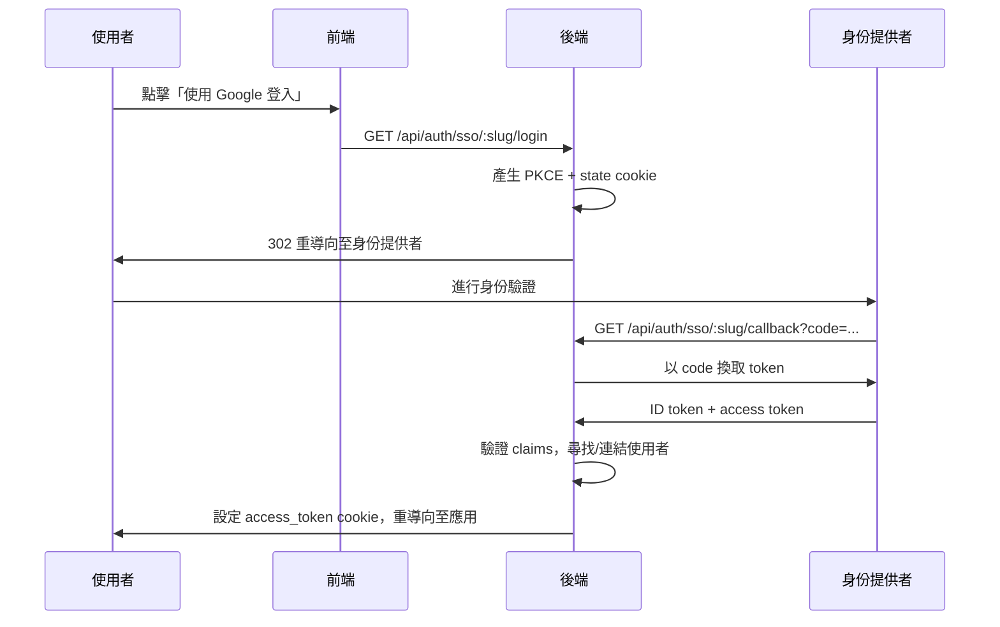
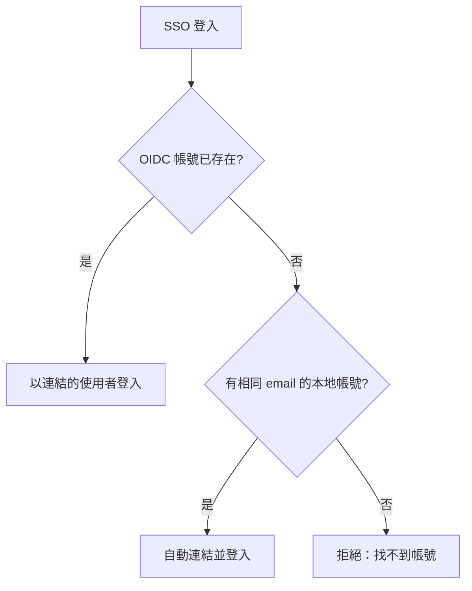

# SSO（單一登入）

透過 OIDC 整合企業身份提供者，實現無縫單一登入。

## 概述

Open Short URL 支援 **OpenID Connect (OIDC)** 單一登入，允許使用者透過現有的組織帳號登入（Google Workspace、Azure AD、Okta 等）。可同時設定多個身份提供者。

### 主要特點

- 通用 OIDC 支援 — 適用於任何符合 OIDC 規範的身份提供者
- 支援多個同時啟用的提供者
- 依 Email 自動連結 — 將 OIDC 身份與現有本地帳號配對
- SSO 與密碼登入共存（可選擇強制僅 SSO 登入）
- 管理員透過 UI 進行 CRUD 管理

## 運作流程



## 設定提供者

### 前置需求

1. 在身份提供者處註冊您的應用程式
2. 取得 **Client ID** 和 **Client Secret**
3. 設定 **Redirect URI** 為：`https://your-backend-domain/api/auth/sso/{slug}/callback`
4. 在 Open Short URL 中預先建立使用者帳號（SSO 不會自動建立帳號）

### 管理介面

在管理後台導航至 **系統 > SSO 身份提供者** 來管理提供者。

| 操作 | 說明 |
|------|------|
| 新增提供者 | 設定新的 OIDC 身份提供者 |
| 編輯 | 更新提供者設定（slug 不可修改） |
| 啟用/停用 | 切換提供者在登入頁面的顯示 |
| 刪除 | 移除提供者並解除關聯的 SSO 帳號連結 |

### 提供者設定欄位

| 欄位 | 說明 | 必填 |
|------|------|:----:|
| 名稱 | 顯示在登入頁面的名稱 | 是 |
| 識別碼 (Slug) | URL 安全的識別碼（例如 `google`、`azure-ad`） | 是 |
| Discovery URL | OIDC well-known 設定網址 | 是 |
| Client ID | 身份提供者的 OAuth Client ID | 是 |
| Client Secret | OAuth Client Secret | 是 |
| 權限範圍 (Scopes) | 以空格分隔的 OIDC 權限範圍 | 否（預設：`openid email profile`） |
| 啟用 | 提供者是否顯示在登入頁面 | 否（預設：`true`） |

### 管理 API

```
POST /api/admin/oidc-providers
```

```json
{
  "name": "Google Workspace",
  "slug": "google",
  "discoveryUrl": "https://accounts.google.com/.well-known/openid-configuration",
  "clientId": "your-client-id.apps.googleusercontent.com",
  "clientSecret": "your-client-secret",
  "scopes": "openid email profile",
  "isActive": true
}
```

::: warning
`clientSecret` 為唯寫欄位。建立和更新時接受輸入，但 API 回應中永遠不會回傳。回應中以 `hasClientSecret` 布林值表示是否已設定密鑰。
:::

### 常見身份提供者範例

**Microsoft Azure AD：**
```
Discovery URL: https://login.microsoftonline.com/{tenant-id}/v2.0/.well-known/openid-configuration
```

**Okta：**
```
Discovery URL: https://{your-domain}.okta.com/.well-known/openid-configuration
```

**Keycloak：**
```
Discovery URL: https://{host}/realms/{realm}/.well-known/openid-configuration
```

### 範例：Google Workspace

以下是將 Google 設定為 SSO 提供者的完整步驟。

#### 1. 在 Google Cloud Console 建立 OAuth 憑證

1. 前往 [Google Cloud Console](https://console.cloud.google.com/)，選擇您的專案
2. 導航至 **APIs & Services > Credentials**
3. 點擊 **Create Credentials > OAuth client ID**
4. 應用程式類型選擇 **Web application**
5. 設定名稱（例如 `Open Short URL SSO`）
6. 在 **Authorized redirect URIs** 中加入：
   ```
   https://your-backend-domain/api/auth/sso/google/callback
   ```
7. 點擊 **Create**，記下 **Client ID** 和 **Client Secret**

::: tip
如果 Google Cloud 專案的 OAuth 同意畫面設為 **Internal**，則只有您的 Google Workspace 組織內的使用者可以登入。若要允許任何 Google 帳號，請設為 **External**。
:::

#### 2. 在 Open Short URL 中設定

導航至 **系統 > SSO 身份提供者**，點擊 **新增提供者**，填入以下設定：

| 欄位 | 值 |
|------|-----|
| 名稱 | `Google Workspace` |
| 識別碼 | `google` |
| Discovery URL | `https://accounts.google.com/.well-known/openid-configuration` |
| Client ID | *（步驟 1 取得）* |
| Client Secret | *（步驟 1 取得）* |
| 權限範圍 | `openid email profile` |

或透過管理 API：

```bash
curl -X POST https://your-backend-domain/api/admin/oidc-providers \
  -H "Content-Type: application/json" \
  -H "Cookie: access_token=YOUR_TOKEN" \
  -d '{
    "name": "Google Workspace",
    "slug": "google",
    "discoveryUrl": "https://accounts.google.com/.well-known/openid-configuration",
    "clientId": "YOUR_CLIENT_ID.apps.googleusercontent.com",
    "clientSecret": "YOUR_CLIENT_SECRET",
    "scopes": "openid email profile",
    "isActive": true
  }'
```

#### 3. 預先建立使用者帳號

確保將透過 Google SSO 登入的使用者已在 Open Short URL 中建立帳號，且 **email 地址相符**。SSO 不會自動建立帳號。

#### 4. 測試登入

1. 前往登入頁面 — 應該會看到 **「使用 Google Workspace 登入」** 按鈕
2. 點擊後將重導向至 Google 同意畫面
3. 完成驗證後，將自動返回 Dashboard

## 帳號連結

SSO 登入依以下邏輯配對使用者：



1. **已有連結** — 如果 OIDC 身份（提供者 + subject ID）已與本地帳號連結，直接登入
2. **Email 配對** — 如果沒有連結但有相同 email 的本地帳號，自動連結並登入
3. **無配對** — 如果沒有對應的本地帳號，登入將被拒絕。管理員必須預先建立帳號

::: info
SSO **不會**自動建立使用者帳號。這是設計決策 — 只有管理員可以在 Open Short URL 中建立帳號。
:::

## 強制 SSO

啟用 SSO 強制模式時，密碼登入將被封鎖。使用者必須透過已設定的 SSO 提供者進行驗證。

透過系統設定管理：

| 設定鍵 | 值 | 效果 |
|--------|-----|------|
| `sso_enforce` | `true` | 當有啟用的提供者時封鎖密碼登入 |
| `sso_enforce` | `false` | 同時允許密碼和 SSO 登入（預設） |

::: warning
啟用強制模式前，請確保已設定至少一個啟用的 SSO 提供者。如果強制模式開啟但沒有啟用的提供者，密碼登入將作為備援保持可用。
:::

## 安全性

### PKCE + Nonce

所有 SSO 流程使用 **PKCE**（Proof Key for Code Exchange）和 **nonce** 驗證：
- PKCE 防止授權碼攔截攻擊
- Nonce 防止 token 重放攻擊
- 兩者都儲存在簽名的 httpOnly state cookie 中（10 分鐘有效期）

### 狀態管理

OIDC state 參數以簽名 JWT 的形式儲存在 httpOnly cookie 中 — 不需要伺服器端的 session 儲存。這與平台的無狀態 JWT 架構一致。

### SSO 與 2FA

SSO 登入**跳過**本地兩步驟驗證。假設身份提供者自行處理其 MFA。如需 MFA，請在身份提供者層級設定。

## 錯誤處理

SSO 錯誤會重導向至登入頁面並附帶錯誤代碼：

| 錯誤代碼 | 說明 |
|----------|------|
| `sso_user_not_found` | 沒有本地帳號與此 SSO 身份配對 |
| `sso_account_inactive` | 配對的帳號已停用 |
| `sso_email_not_verified` | 身份提供者回報 email 未驗證 |
| `sso_state_invalid` | SSO 工作階段已過期或 state 不符 |
| `sso_provider_disabled` | SSO 提供者目前已停用 |
| `sso_provider_not_found` | 請求的 SSO 提供者不存在 |
| `sso_failed` | 一般 SSO 失敗 |

## 下一步

- [API 金鑰](/zh-TW/features/api-keys) — 程式化 API 存取
- [稽核日誌](/zh-TW/features/audit-logs) — 追蹤 SSO 登入事件
- [Webhooks](/zh-TW/features/webhooks) — 即時事件通知
