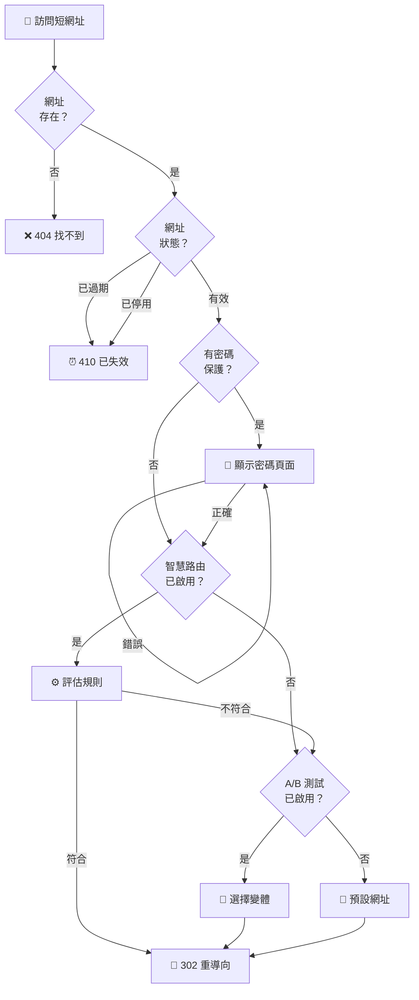

# 短網址

建立並管理具有強大功能的短網址。

## 概覽

Open Short URL 提供全方位的網址縮短服務，包含自訂短碼、密碼保護、過期設定、UTM 追蹤等功能。

### 重導向流程



## 建立短網址

### 基本用法

```json
POST /api/urls

{
  "originalUrl": "https://example.com/very/long/path/to/page"
}
```

**回應：**

```json
{
  "id": "url_123",
  "slug": "abc123",
  "originalUrl": "https://example.com/very/long/path/to/page",
  "shortUrl": "https://your-domain.com/abc123",
  "createdAt": "2025-01-15T10:00:00Z"
}
```

### 自訂短碼

使用自訂短碼建立易記的網址：

```json
POST /api/urls

{
  "originalUrl": "https://example.com/page",
  "customSlug": "my-campaign"
}
```

**短碼規則：**

| 限制 | 說明 |
|-----|------|
| 字元 | a-z、A-Z、0-9、連字號（-）、底線（_） |
| 長度 | 3-50 字元 |
| 唯一性 | 必須全域唯一 |

### 自動產生短碼

如未指定自訂短碼，系統會自動產生：

| 設定 | 預設值 |
|-----|--------|
| 長度 | 6 字元 |
| 字元 | 小寫英文字母和數字 |
| 碰撞處理 | 自動重試 |

## 功能

### 密碼保護

為敏感連結設定密碼保護：

```json
POST /api/urls

{
  "originalUrl": "https://example.com/sensitive-page",
  "password": "secret123"
}
```

**運作方式：**

- 訪客點擊連結時會看到密碼輸入頁面
- 密碼以 bcrypt 加密儲存
- 錯誤輸入次數有速率限制

### 過期設定

為限時活動設定過期日期：

```json
POST /api/urls

{
  "originalUrl": "https://example.com/flash-sale",
  "expiresAt": "2025-12-31T23:59:59Z"
}
```

**過期後行為：**

- 過期連結返回 410 Gone 狀態
- 點擊不計入統計
- 可以延長過期時間

### UTM 參數

自動附加 UTM 參數以追蹤來源：

```json
POST /api/urls

{
  "originalUrl": "https://example.com/page",
  "utmSource": "newsletter",
  "utmMedium": "email",
  "utmCampaign": "summer_sale",
  "utmTerm": "discount",
  "utmContent": "cta_button"
}
```

**支援的參數：**

| 參數 | 說明 | 範例 |
|-----|------|------|
| `utmSource` | 流量來源 | newsletter、google、facebook |
| `utmMedium` | 行銷媒介 | email、cpc、social |
| `utmCampaign` | 活動名稱 | summer_sale、black_friday |
| `utmTerm` | 付費關鍵字 | running+shoes |
| `utmContent` | 廣告內容 | banner_ad、text_link |

### QR Code

為任何短網址產生 QR Code：

```
GET /api/urls/{id}/qrcode?width=300&color=%23000000
```

**參數：**

| 參數 | 說明 | 預設值 |
|-----|------|--------|
| `width` | 寬度（像素） | 300 |
| `color` | 顏色（十六進位） | #000000 |

**回應：** Base64 格式的 Data URL

## 批量操作

### 批量建立

一次建立多個短網址：

```json
POST /api/urls/bulk/create

{
  "urls": [
    { "originalUrl": "https://example.com/page1" },
    { "originalUrl": "https://example.com/page2", "customSlug": "page2" },
    { "originalUrl": "https://example.com/page3" }
  ]
}
```

### CSV 匯入

從 CSV 檔案批量匯入：

```
POST /api/urls/bulk/import
Content-Type: multipart/form-data
```

**CSV 格式：**

```csv
originalUrl,customSlug,title,utmSource,utmMedium,utmCampaign
https://example.com/page1,my-slug,頁面標題,newsletter,email,summer
https://example.com/page2,,另一個頁面,social,facebook,
```

### 批量更新

批量更新多個短網址：

```json
PATCH /api/urls/bulk

{
  "urlIds": ["url_1", "url_2", "url_3"],
  "operation": "status",
  "value": "INACTIVE"
}
```

**支援的操作：**

| 操作 | 說明 |
|------|------|
| `status` | 更新狀態（ACTIVE/INACTIVE） |
| `bundle` | 加入分組 |

### 批量刪除

批量刪除短網址：

```json
DELETE /api/urls/bulk

{
  "urlIds": ["url_1", "url_2", "url_3"]
}
```

### CSV 匯出

匯出短網址資料：

```
GET /api/urls/export?format=csv&search=campaign
```

**參數：**

| 參數 | 說明 |
|------|------|
| `format` | csv 或 json |
| `search` | 搜尋篩選 |
| `status` | 狀態篩選 |

## 網址管理

### 列出網址

```
GET /api/urls?page=1&pageSize=20&search=campaign&status=ACTIVE
```

**查詢參數：**

| 參數 | 說明 | 預設值 |
|-----|------|--------|
| `page` | 頁碼 | 1 |
| `pageSize` | 每頁數量 | 20 |
| `search` | 搜尋標題、短碼、原始網址 | - |
| `status` | 篩選狀態 | - |
| `sortBy` | 排序欄位 | createdAt |
| `sortOrder` | 排序方向 | desc |

### 取得單一網址

```
GET /api/urls/{id}
```

### 更新網址

```json
PUT /api/urls/{id}

{
  "title": "新標題",
  "description": "新描述",
  "originalUrl": "https://example.com/new-page",
  "status": "ACTIVE"
}
```

### 刪除網址

```
DELETE /api/urls/{id}
```

## 網址狀態

| 狀態 | 說明 |
|-----|------|
| `ACTIVE` | 網址運作中，重新導向正常 |
| `INACTIVE` | 網址已停用，顯示停用頁面 |

## 速率限制

| 操作 | 限制 |
|-----|------|
| 網址建立 | 30 次/分鐘 |
| 網址取得 | 60 次/分鐘 |
| 批量操作 | 10 次/分鐘 |

## 最佳實踐

### 1. 使用描述性短碼

建立易於記憶和分享的短碼：
- ✅ `summer-sale-2025`
- ✅ `product-launch`
- ❌ `abc123xyz`

### 2. 設定過期時間

為臨時活動設定過期時間：
- 促銷活動 → 設定活動結束日期
- 一次性連結 → 設定短期過期
- 永久連結 → 不設定過期

### 3. 追蹤活動

使用 UTM 參數追蹤不同來源：
- 電子報連結 → `utm_source=newsletter`
- 社群貼文 → `utm_source=facebook`
- 付費廣告 → `utm_source=google_ads`

### 4. 使用分組整理

將相關網址整理到分組中：
- 依活動分組
- 依客戶分組
- 依專案分組

## 下一步

- [數據分析](/zh-TW/features/analytics) - 追蹤網址表現
- [A/B 測試](/zh-TW/features/ab-testing) - 優化轉換率
- [智慧路由](/zh-TW/features/smart-routing) - 條件式導向
