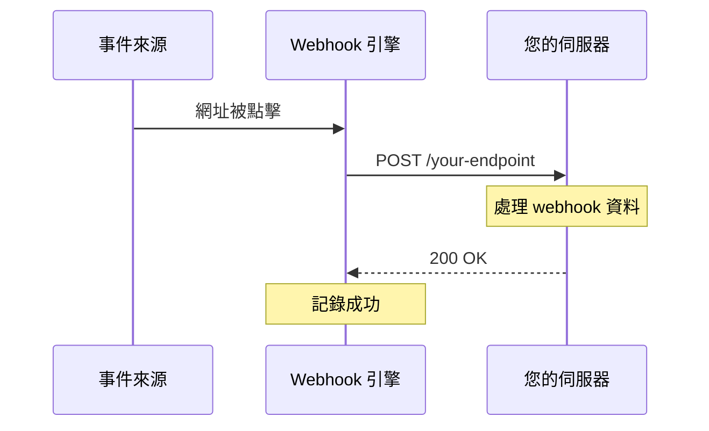
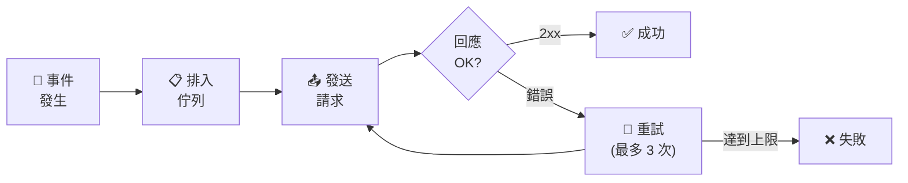

# Webhooks

當短網址系統發生事件時接收即時通知。

## 概覽

Webhooks 允許您透過在特定事件發生時發送 HTTP 請求，將 Open Short URL 與外部系統整合。



### Webhook 生命週期



## 支援的事件

| 事件 | 說明 |
|-----|------|
| `url.created` | 建立新短網址 |
| `url.updated` | 更新短網址 |
| `url.deleted` | 刪除短網址 |
| `url.clicked` | 短網址被點擊 |
| `routing.rule_created` | 建立路由規則 |
| `routing.rule_updated` | 更新路由規則 |
| `routing.rule_deleted` | 刪除路由規則 |
| `routing.rule_matched` | 路由規則匹配訪客 |

## 建立 Webhook

### 建立新 Webhook

```json
POST /api/webhooks

{
  "name": "點擊通知",
  "url": "https://your-server.com/webhooks/clicks",
  "secret": "your-webhook-secret",
  "events": ["url.clicked"],
  "headers": {
    "Authorization": "Bearer your-token"
  },
  "isActive": true
}
```

**參數：**

| 參數 | 說明 | 必填 | 預設值 |
|-----|------|:----:|--------|
| `name` | Webhook 名稱（最多 100 字元） | ✅ | - |
| `url` | 目標 URL（公開、HTTPS） | ✅ | - |
| `secret` | 簽章密鑰（最多 255 字元） | ❌ | - |
| `events` | 訂閱的事件 | ✅ | - |
| `headers` | 自訂 HTTP 標頭 | ❌ | {} |
| `isActive` | 是否啟用 | ❌ | true |

### 事件選擇

訂閱多個事件：

```json
{
  "events": ["url.created", "url.clicked", "url.deleted"]
}
```

::: warning
您必須指定至少一個事件。
:::

## 管理 Webhook

### 列出 Webhook

```
GET /api/webhooks?page=1&pageSize=10&search=click
```

### 取得 Webhook 詳情

```
GET /api/webhooks/{id}
```

### 更新 Webhook

```json
PUT /api/webhooks/{id}

{
  "name": "更新後的名稱",
  "events": ["url.clicked", "url.created"],
  "isActive": true
}
```

### 刪除 Webhook

```
DELETE /api/webhooks/{id}
```

## Payload 結構

### 通用欄位

所有 webhook payload 包含：

```json
{
  "event": "url.clicked",
  "timestamp": "2025-01-15T10:30:00Z",
  "data": { ... }
}
```

### url.created

```json
{
  "event": "url.created",
  "timestamp": "2025-01-15T10:30:00Z",
  "data": {
    "id": "url_123",
    "slug": "my-link",
    "originalUrl": "https://example.com/page",
    "title": "My Link",
    "userId": "user_456",
    "createdAt": "2025-01-15T10:30:00Z"
  }
}
```

### url.updated

```json
{
  "event": "url.updated",
  "timestamp": "2025-01-15T10:35:00Z",
  "data": {
    "id": "url_123",
    "slug": "my-link",
    "changes": {
      "title": {
        "old": "舊標題",
        "new": "新標題"
      }
    }
  }
}
```

### url.clicked

```json
{
  "event": "url.clicked",
  "timestamp": "2025-01-15T10:40:00Z",
  "data": {
    "urlId": "url_123",
    "variantId": "var_789",
    "clickData": {
      "ip": "192.168.1.1",
      "userAgent": "Mozilla/5.0...",
      "referer": "https://google.com",
      "country": "Taiwan",
      "city": "Taipei",
      "device": "Mobile",
      "os": "iOS",
      "browser": "Safari",
      "utmSource": "newsletter",
      "utmMedium": "email",
      "utmCampaign": "summer",
      "utmTerm": null,
      "utmContent": null
    }
  }
}
```

### routing.rule_matched

```json
{
  "event": "routing.rule_matched",
  "timestamp": "2025-01-15T10:45:00Z",
  "data": {
    "urlId": "url_123",
    "ruleId": "rule_456",
    "ruleName": "iOS 使用者",
    "targetUrl": "https://apps.apple.com/app/myapp",
    "clickData": { ... }
  }
}
```

## 簽章驗證

使用簽章標頭驗證 webhook 真實性。

### 發送的標頭

| 標頭 | 說明 |
|-----|------|
| `X-Webhook-Signature` | HMAC-SHA256 簽章 |
| `X-Webhook-Event` | 事件類型 |
| `X-Webhook-Delivery-ID` | 唯一傳送 ID |

### 簽章格式

```
X-Webhook-Signature: sha256=<hash>
```

### 驗證步驟

1. 取得原始請求 body（JSON 字串）
2. 使用您的密鑰計算 HMAC-SHA256
3. 與簽章標頭比較

**Node.js 範例：**

```javascript
const crypto = require('crypto');

function verifyWebhookSignature(payload, signature, secret) {
  const expectedSignature = 'sha256=' +
    crypto.createHmac('sha256', secret)
      .update(payload)
      .digest('hex');

  return crypto.timingSafeEqual(
    Buffer.from(signature),
    Buffer.from(expectedSignature)
  );
}

// 在您的 webhook handler 中
app.post('/webhook', (req, res) => {
  const signature = req.headers['x-webhook-signature'];
  const payload = JSON.stringify(req.body);

  if (!verifyWebhookSignature(payload, signature, 'your-secret')) {
    return res.status(401).send('Invalid signature');
  }

  // 處理 webhook...
  res.status(200).send('OK');
});
```

**Python 範例：**

```python
import hmac
import hashlib

def verify_webhook_signature(payload, signature, secret):
    expected = 'sha256=' + hmac.new(
        secret.encode(),
        payload.encode(),
        hashlib.sha256
    ).hexdigest()
    return hmac.compare_digest(signature, expected)
```

## 傳送與重試

### 傳送統計

每個 webhook 追蹤：

| 指標 | 說明 |
|-----|------|
| `totalSent` | 嘗試傳送總數 |
| `totalSuccess` | 成功傳送數 |
| `totalFailed` | 失敗傳送數 |
| `lastSentAt` | 最後傳送時間 |
| `lastError` | 最後錯誤訊息 |

### 重試行為

失敗的傳送會自動重試：
- 指數退避
- 最多重試 3 次
- 記錄以供除錯

### Webhook 日誌

查看傳送歷史：

```
GET /api/webhooks/{id}/logs?page=1&pageSize=20
```

**回應：**

```json
{
  "logs": [
    {
      "id": "log_123",
      "event": "url.clicked",
      "status": "success",
      "statusCode": 200,
      "responseBody": "OK",
      "attempt": 1,
      "sentAt": "2025-01-15T10:40:00Z"
    },
    {
      "id": "log_124",
      "event": "url.clicked",
      "status": "failed",
      "statusCode": 500,
      "responseBody": "Internal Server Error",
      "attempt": 1,
      "sentAt": "2025-01-15T10:45:00Z"
    }
  ]
}
```

## 測試 Webhook

### 發送測試 Payload

```
POST /api/webhooks/{id}/test
```

發送測試 payload 以驗證端點是否正常運作：

```json
{
  "event": "webhook.test",
  "timestamp": "2025-01-15T10:50:00Z",
  "data": {
    "message": "這是一個測試 webhook 傳送"
  }
}
```

## 最佳實踐

### 1. 務必驗證簽章

永遠不要在未驗證的情況下信任 webhook payload：
- 務必設定 webhook 密鑰
- 驗證每個傳入請求
- 拒絕無效簽章

### 2. 快速回應

盡快返回 200 OK：
- 非同步處理 webhook
- 使用訊息佇列處理繁重作業
- 在處理前回應

### 3. 處理冪等性

Webhook 可能會傳送多次：
- 儲存已處理的傳送 ID
- 跳過重複傳送
- 設計 handler 為冪等

### 4. 使用 HTTPS

務必使用 HTTPS 端點：
- 保護 payload 資料
- 需要用於簽章驗證
- 防止中間人攻擊

### 5. 監控失敗

關注傳送問題：
- 定期檢查 webhook 日誌
- 設定失敗警報
- 調查持續性錯誤

## 使用案例

### 即時分析

將點擊追蹤到外部系統：

```json
{
  "events": ["url.clicked"]
}
```

→ 發送到 Google Analytics、Mixpanel 等

### Slack 通知

建立新網址時接收通知：

```json
{
  "events": ["url.created"],
  "url": "https://hooks.slack.com/services/..."
}
```

### CRM 整合

點擊時更新客戶記錄：

```json
{
  "events": ["url.clicked"],
  "headers": {
    "X-API-Key": "your-crm-key"
  }
}
```

### 自訂儀表板

將資料傳送到您自己的分析系統：

```json
{
  "events": ["url.clicked", "url.created", "url.deleted"]
}
```

## 速率限制

| 操作 | 限制 |
|-----|------|
| Webhook 管理 | 5 次/分鐘 |
| Webhook 傳送 | 無限制（非同步） |

## Webhook 逾時

- 預設逾時：30 秒
- 逾時的請求標記為失敗
- 透過 `WEBHOOK_TIMEOUT` 環境變數設定

## 下一步

- [API Keys](/zh-TW/features/api-keys) - 驗證 API 請求
- [數據分析](/zh-TW/features/analytics) - 追蹤效能
- [智慧路由](/zh-TW/features/smart-routing) - 條件式路由
