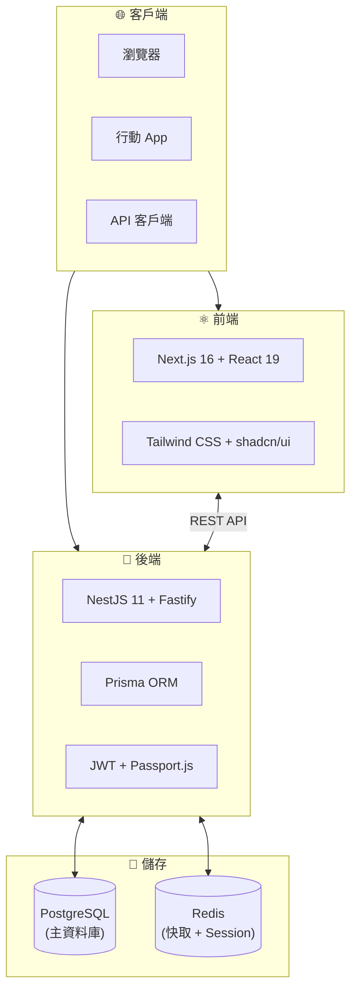
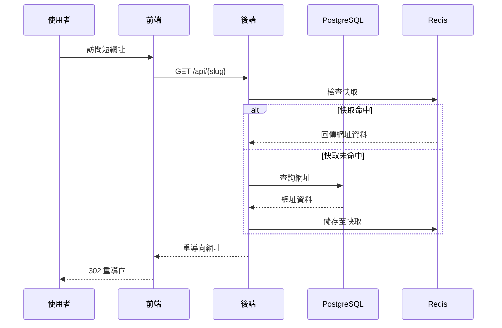

# 介紹

Open Short URL 是一個開源、白標化、可自建部署的短網址平台，具備強大的數據分析與 A/B 測試功能。

## 概覽

Open Short URL 提供完整的短網址建立、管理與分析解決方案。採用現代技術棧（NestJS + Next.js）建構，提供企業級功能，同時保持易於部署和自訂。

## 主要功能

### 網址管理
- **自訂短碼** - 建立易記的自訂短網址
- **密碼保護** - 為敏感連結設定密碼
- **過期設定** - 設定時間或點擊數限制
- **UTM 追蹤** - 自動附加 UTM 參數
- **QR Code 產生** - 為任何短網址產生 QR Code
- **批量操作** - 透過 CSV 匯入/匯出網址

### 數據分析
- **即時追蹤** - 即時監控點擊數據
- **地理位置分析** - 國家、地區、城市層級數據
- **裝置與瀏覽器統計** - 識別訪客裝置與瀏覽器
- **來源追蹤** - 了解流量來源
- **機器人偵測** - 從報告中過濾機器人流量
- **資料匯出** - 匯出分析資料為 CSV 或 JSON

### A/B 測試與智慧路由
- **流量分流** - 將流量分配到多個目標
- **條件式路由** - 根據裝置、位置、時間等條件路由
- **路由範本** - 預建的常見情境規則
- **效能分析** - 比較變體表現

### 企業級功能
- **白標化** - 自訂品牌（Logo、顏色、名稱）
- **API 存取** - 完整的 REST API 與 OpenAPI 文檔
- **Webhook 整合** - 即時事件通知
- **稽核日誌** - 追蹤所有系統活動
- **雙因素認證** - 增強帳戶安全性
- **使用者管理** - 多用戶支援與角色權限

## 技術棧

| 層級 | 技術 |
|------|------|
| **後端** | NestJS 11 + Fastify |
| **前端** | Next.js 16 + React 19 |
| **資料庫** | PostgreSQL 15+ |
| **快取** | Redis 7+ |
| **ORM** | Prisma 7 |
| **UI** | Tailwind CSS + shadcn/ui |
| **認證** | JWT + Passport.js |

## 架構

### 請求流程

## 為什麼選擇 Open Short URL？

### 開源
- MIT 授權，完全透明的程式碼
- 活躍的開發與社群
- 無供應商鎖定

### 自建部署
- 完全的資料所有權
- 部署在您的基礎設施
- 符合資料法規要求

### 功能豐富
- 企業級功能，無需企業級價格
- 開箱即用的完整分析功能
- 可透過 API 和 Webhook 擴展

### 開發者友善
- 現代技術棧
- 端對端 TypeScript
- 自動產生的 API 類型
- 完整文檔

## 使用案例

- **行銷團隊** - 使用 UTM 參數追蹤活動成效
- **產品團隊** - A/B 測試著陸頁和功能
- **開發者** - 透過 API 整合動態連結產生
- **企業** - 自建部署以符合資料法規和品牌需求
- **內容創作者** - 分享和追蹤連結互動

## 開始使用

準備好開始了嗎？請參閱我們的指南：

1. [快速開始](/zh-TW/guide/getting-started) - 5 分鐘內啟動運行
2. [安裝指南](/zh-TW/guide/installation) - 詳細安裝說明
3. [設定指南](/zh-TW/guide/configuration) - 配置您的環境
4. [Docker 部署](/zh-TW/deployment/docker) - 使用 Docker 部署

## 社群與支援

- **GitHub**：[github.com/supra126/open-short-url](https://github.com/supra126/open-short-url)
- **問題回報**：[回報錯誤與功能請求](https://github.com/supra126/open-short-url/issues)
- **授權**：MIT
